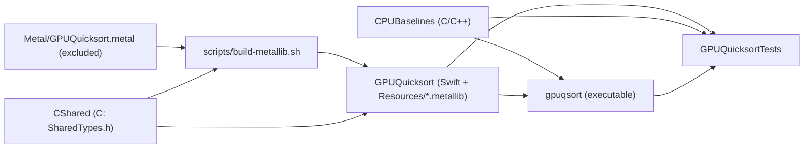

# Implementation plan — gpu-quicksort-revisited (implementing `SPEC.md` v0.4)

> - **Target:** Swift package `GPUQuicksort` (a library, the `gpuqsort` CLI, the `CShared` and `CPUBaselines` C/C++ targets, `scripts/build-metallib.sh`, and the checked-in `.metallib` resources), satisfying `SPEC.md` v0.4 (sha256 `b05ffbd347f63bb89a07c40d9b54986f69641f2717d6a79f8f7a6936ba3563e0`, 816 lines, 128 ids per `speccheck` 1.20.0).
> - **Size expectation:** the spec states none. This plan budgets **1,900–2,800 production code lines** (~22 files: Swift, MSL, C/C++), plus 1,800–2,600 test lines and 150–250 non-source lines (build script, Python golden generator, manifest).
> - **Method:** red-green-refactor over the §9 test groups; verification apparatus (oracles, generators, goldens) before the kernels it checks; `SPEC.md` is never edited by the build (spec defects go through `fix(gpu-quicksort):` with a version bump).

---

## 1. Verdict

Build **bottom-up, in five waves plus a proof wave**:
1. packaging and the Metal build pipeline;
2. the pure oracles (codec, generators, `optp`, table, CPU references);
3. the sorter's API plus **phase two alone**;
4. phase one;
5. instrumentation and fault injection;
6. the CLI;
7. the proof wave: the recorded runs and the conformance audit.

Three decisions carry the plan:
- **Phase two lands before phase one.** D-22 makes $\mathit{maxseq} = 1$ a complete sorter using `lqsort` alone. So wave W2 ends with a correct end-to-end GPU sort that the whole T-01 correctness suite can run against. W3 then adds phase one behind the same oracle.
- **The CPU oracle and the independent Python generator land in W1, before any kernel.** Every GPU test compares against them, never against the GPU's own previous output.
- **The recorded runs** (`tune` producing the committed table, and `bench`) happen only in the last wave, from a release build (F-020).

The plan will not start kernel work before the Metal toolchain exists (see §7). It will not fit the size by dropping O-2, `tune` or the CPU baselines; each has its own tests.

## 2. What the evidence says (this is not a greenfield guess)

There are no prior builds. Measured facts about the starting tree and the environment on 2026-09-25:

| Item | Measured |
| ---- | -------- |
| Repository | git, 7 commits; the paper (kept locally, not in the repository), `SPEC.md` v0.4, `SPEC_REVIEW_REPORT.md` (round 2: Level 3, READY WITH MINOR FIXES, all findings folded into v0.4) |
| Source or test code | none (0 files under `Sources/`, `Tests/`) |
| `speccheck check --spec SPEC.md --judge mock` | 128 ids, 128 uncited, 0 dangling, 0 stale; 299 edges (117 verifies, 99 depends_on, 83 affects) |
| Swift | Apple Swift 6.4 (swiftlang-6.4.0.34.1), Xcode 27.0 (27A266a) |
| Metal compiler | **missing**: `xcrun -sdk macosx metal` reports "missing Metal Toolchain"; `xcodebuild -showComponent MetalToolchain` reports `Status: uninstalled` |
| GPU | Apple M5 Max (the spec's reference machine), 128 GB |
| speccheck | 1.20.0 at `~/.local/bin/speccheck` (Swift adapter available) |
| LLM judge | Ollama at `localhost:11434` serving `qwen3:8b` |
| Tools | `uv`, `cloc`, `python3` present |

Systemic risks the evidence and the two review rounds expose:
- **Memory-model races** (R-28, I-007) that pass by luck on one threadgroup size and fail on another.
- **Layout drift** between the Swift and MSL views of C-05/C-06.
- **A stale `.metallib`** shipped against edited source.
- **Tests that certify the GPU against itself.**

## 3. Shape

*Figure — target graph per C-09, C-11, R-27.*

- **Layout.** C-09 fixes the paths. Files are named after §11's components: `GPUQuicksort.swift`, `Sorter.swift`, `KeyCodec.swift`, `ParameterResolver.swift`, `TunedParameters.swift`, `Distributions.swift` (with `MT19937`), `CPUReference.swift`, `BufferPool.swift`, `CommandRunner.swift`, `ShaderLibrary.swift`, `Diagnostics.swift`, `TestHooks.swift`; CLI `Tuner.swift` plus one file per subcommand.
- **Layer direction:** `CShared` → pure Swift (codec, generators, parameters, table) → Metal plumbing (`ShaderLibrary`, `CommandRunner`, `BufferPool`) → `Sorter` → `GPUQuicksort` (public API) → CLI. There are no cycles, and the CLI uses only the public API plus `package`-level hooks.
- **Purity rule:** the pure layer reads no clock, no device, and no bundle. `TunedParameters` parses bytes it is given, and the bundle lookup lives in `GPUQuicksort.init`.
- **No rendered surface.** There is no visual oracle. The oracles are CPUReference (a CPU sort), the Python generator (T-25), hand-computed fits (T-37), and CPU recomputation of pivots (T-41).

## 4. Order (waves; each ends at a gate)

1. **W0 Packaging and the Metal pipeline:**
   - `Package.swift` with every target;
   - `CShared` (`SharedTypes.h`, `CShared.c`);
   - `scripts/build-metallib.sh` with `OUT_DIR` and the stamp;
   - the MSL file with `key_encode`/`key_decode` plus the layout probe;
   - `ShaderLibrary` loading from `Bundle.module`.

   Gate: `scripts/build-metallib.sh && swift build && swift test --filter "T31|T36"`. Covers T-31 and T-36; T-35 is half-covered until W3 adds the last kernel.
2. **W1 Pure oracles:**
   - `KeyCodec` (C-04);
   - `MT19937` and `Distributions` (C-08), plus `Tests/Fixtures/gen_reference.py` and `golden.json`;
   - `ParameterResolver` (`optp`, clamps: K-04, K-05);
   - `TunedParameters` (the read side of C-10, the fit, `TuningSource`) and the bootstrap `TunedParameters.json`;
   - `CPUReference`, and `CPUBaselines` (C-11).

   Gate: `swift test --filter "T05|T20|T25|T26|T37|T39"` (the CPU parts). *The oracles exist before any sorting kernel.*
3. **W2 API plus phase two:**
   - `GPUQuicksort` (init, validation, locking, `SortReport`);
   - `BufferPool`, `CommandRunner`, `Sorter` (with the E-03 and $\mathit{maxseq} = 1$ paths);
   - kernel `lqsort` (two-pass partition, R-28 barriers, stack, bitonic);
   - GPU encode/decode.

   Gate: T-01 and T-04 run with $\mathit{maxseq} = 1$, plus T-05 (GPU), T-06, T-07, T-18, T-19, T-40. *The first end-to-end sorter.*
4. **W3 Phase one:** `gqsort_partition` (one fetch-and-add per side), `gqsort_fill`, the host iteration loop (R-08, K-06, K-07, E-17, E-24), the read-back checks (E-10), and O-2 (min/max atomics).

   Gate: the whole of §9.1 with default parameters (T-01..T-11), plus T-03, T-41 and T-35 in full.
5. **W4 Instrumentation, reports, diagnostics:**
   - `TestHooks` (dispatch, atomic and finalization counters; fault injection);
   - `bookkeepingBytes` and provenance;
   - the `diagnostics` handler.

   Gate: T-12..T-16, T-21..T-24, T-29 (library), T-42 (library).
6. **W5 CLI:** the `info`, `gen`, `sort`, `verify`, `bench` and `tune` subcommands, the §7.2 exit table, RFC 4180 CSV, and the debug guards.

   Gate: T-27, T-28, T-29 (CLI), T-30, T-38, T-39 (the bench guard), T-42 (CLI).
7. **W6 Prove it:**
   - `swift build -c release`, then the recorded runs `tune --write --as-default` (T-34, which updates `TunedParameters.json`) and `bench` (T-32, T-33);
   - the T-17 inspection checklist;
   - the README;
   - speccheck Phase A, then Phase B;
   - `SPEC_BUILD_REPORT.md`.

## 5. LOC budget (production code lines, `cloc`, excluding generated `.metallib`)

There are no prior builds of this spec, so every row is an **estimate**. The anchor is the paper's own description (three algorithms, about 60 pseudocode lines) scaled by the typical size of Metal host plumbing. The budget is a ceiling for review, never a floor.

| Slice | Files | LOC |
| ----- | ----- | --- |
| Packaging, `CShared`, `ShaderLibrary` (W0) | 4 | 120–180 |
| Pure oracles: codec, MT19937, distributions, parameters, table, CPU reference, baselines (W1) | 7 | 450–650 |
| API, `Sorter`, `BufferPool`, `CommandRunner`; `lqsort` and codec kernels (W2) | 6 | 550–800 |
| Phase one host loop, `gqsort_partition`, `gqsort_fill`, O-2 (W3) | (edits) + 1 | 250–400 |
| `TestHooks`, `Diagnostics`, report fields (W4) | 2 | 150–250 |
| CLI with 6 subcommands, `Tuner` (W5) | 7 | 400–550 |
| **Total** | **~27** | **1,920–2,830** |
| Tests (separate) | 8 | 1,800–2,600 |
| Build script, Python generator, manifest | — | 150–250 |

If a slice approaches its ceiling, split it; never drop a subsystem to fit.

## 6. Rules that make the likely failures impossible

| Risk | Structural rule |
| ---- | --------------- |
| Races that pass by luck (R-28, I-007) | Every correctness test runs at $T \in \{32, 256, 1024\}$ where valid (T-03 grid), plus a 20-repeat determinism check (T-04). The T-17 checklist names each barrier by line. |
| Swift/MSL layout drift (C-05/C-06) | A single header in `CShared`; T-31 compares `MemoryLayout` against a kernel that reports `sizeof`/`offsetof`, and runs in W0 before any kernel uses the structs. |
| Stale `.metallib` (E-19) | Every wave that edits `.metal` or `.h` runs `scripts/build-metallib.sh` in its gate and commits the outputs; T-35 fails otherwise. |
| The GPU certifying itself | Every oracle comes from W1 (CPU sort, Python generator, hand-computed fits). No test compares GPU output with earlier GPU output, except T-04, which is a determinism test by design. |
| Scratch files breaking the package | No probe files inside `Sources/` or `Tests/`; experiments go to the session scratchpad. |
| False-green commits | Each wave's gate is re-run by the executor immediately before its commit, and the commit body quotes the test summary line. |

**Live verification (W6).** There is no GUI. "Driving the product" means running the release `gpuqsort` binary on the reference machine: `info`, `verify --dist all --key all`, `bench --cpu`, and `tune --write --as-default`, whose outputs are recorded in `SPEC_BUILD_REPORT.md`.

- **Prerequisites:** the Metal toolchain installed (§7), the Apple M5 Max present (measured), about 30 minutes for `tune` (K-14), and a release build.
- **Stand-in:** none is needed. If `tune` cannot be run, T-34 stays skipped with `.disabled(if:)`, R-25 is *verification pending*, and the verdict cannot be PASS (§9 intro).

## 7. One fork, then action

**Install Apple's Metal Toolchain now (`xcodebuild -downloadComponent MetalToolchain`), as D-05 requires.**

- **Why.** R-27 and D-05 (ratified) require precompiled `.metallib` files built by `scripts/build-metallib.sh` with `xcrun metal`. That tool is uninstalled on this machine, so W0's gate cannot run and no kernel can be compiled without it.
- **The alternative** is to compile the shaders at runtime until the toolchain is present. That violates R-27 ("MUST NOT compile MSL source at runtime"), which was the v0.1 choice you explicitly rejected. It would need a spec change and would leave T-35/T-36 failing.
- **Cost of installing:** a one-time download of several hundred megabytes, which modifies the Xcode installation.

**Next concrete action (after the answer):**
1. `xcodebuild -downloadComponent MetalToolchain`
2. `xcrun -sdk macosx metal --version`, expecting exit 0.
3. Execute `DETAILED_IMPLEMENTATION_PLAN_W0.md` item W0-01.
