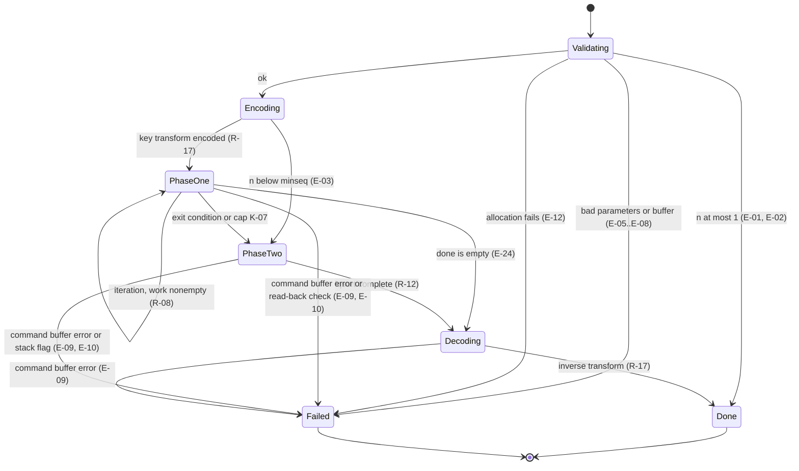
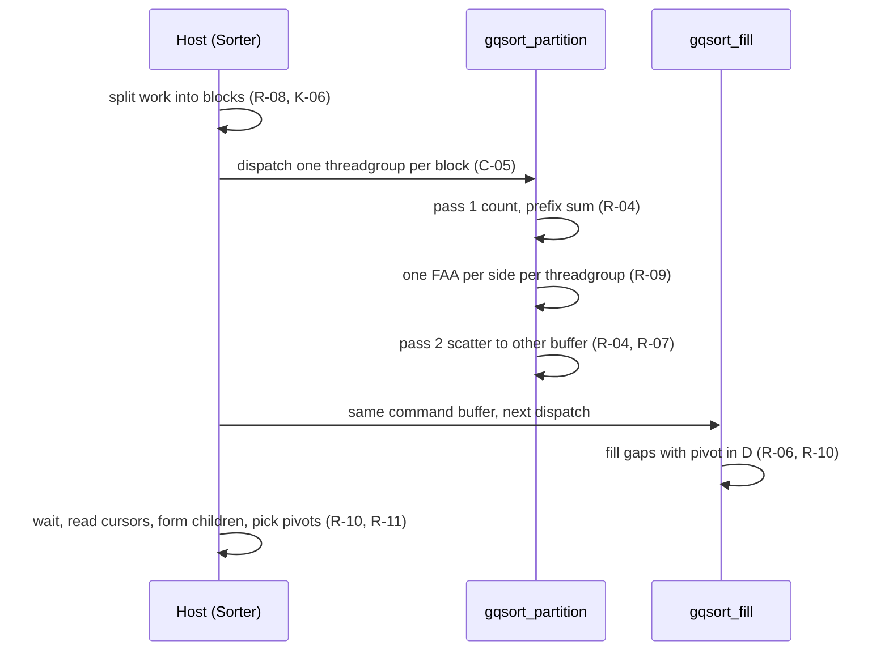

# SPECIFICATION — GPU-Quicksort for Metal (parallel sorting, Swift library + CLI, Swift 6 / Metal on Apple silicon)

> - **Status:** v0.5 — default phase-one pivot changed to `minMaxAverage` and parallel `std::sort` added as a fourth CPU baseline (D-10 revised, D-12 extended, D-23); review findings F-001..F-030 folded in; D-01..D-15 ratified (see §12 and *Revision history*)
> - **Language / stack:** Swift 6 (language mode 6) | Metal Shading Language 3.x, Metal framework, swift-argument-parser | C/C++ shim for CPU baselines (libc `qsort`, C++ `std::sort`) | surfaces: Swift library (`GPUQuicksort`), CLI (`gpuqsort`), build script (`scripts/build-metallib.sh`)
> - **Sources:** D. Cederman and P. Tsigas, *GPU-Quicksort: A Practical Quicksort Algorithm for Graphics Processors*, ACM JEA 14, Art. 1.4 (2009), [doi:10.1145/1498698.1564500](https://doi.org/10.1145/1498698.1564500) (the paper is not included in this repository); cited below as **[P §n]** (sections), **[P Alg n]** (Algorithms 1–3), **[P Fig n]**, **[P Tab n]**. Local build host observed while drafting: Apple M5 Max, macOS 26.6, Swift 6.4, Xcode Metal toolchain.
> - **Scope of this document:** the sorting algorithm (host orchestration + Metal kernels), its Swift API, the benchmark/verification CLI, the input-distribution generators of [P §5.3], and the tests. Not in scope: the other GPU sorts the paper compares against (GPUSort, radix, hybrid), key–value sorting, stable sorting, non-Apple GPUs.
> - **Normative language:** MUST/MUST NOT/SHALL/SHALL NOT = normative; SHOULD = strong recommendation; MAY = optional.
> - **Principle:** *Faithful to the paper's algorithm, correct under Metal's memory model.* Where the paper's pseudocode relies on a CUDA behaviour Metal does not guarantee, or contains an off-by-one, this spec keeps the algorithm's structure (two-pass partition, prefix-sum allocation, atomic block allocation, explicit stack, alternative sort) and changes only the mechanism, and records each change in §12.

---

## 0. Intent and purpose

GPU-Quicksort [P §3] is a two-phase parallel Quicksort for GPUs:

- **Phase one** ([P §3.2.1], [P Alg 1–2]): while there are too few independent subsequences for every threadgroup to have its own, many threadgroups cooperate on the same sequence. Each threadgroup counts elements $<$ and $>$ the pivot in its section (pass 1), computes a prefix sum of those counts, reserves output space for the whole threadgroup with one atomic fetch-and-add per side, and scatters its elements into the auxiliary buffer (pass 2). The host loops until $\mathit{maxseq}$ subsequences exist.
- **Phase two** ([P §3.2.2], [P Alg 3]): each threadgroup owns one subsequence and sorts it entirely on the GPU with the same two-pass partition, an explicit stack in threadgroup memory that always processes the smaller part first, and an alternative sort (bitonic) once a part fits in threadgroup memory.

This project re-implements that algorithm for Apple silicon GPUs in Swift + Metal, so the paper's claims can be revisited on current hardware: that the algorithm is correct for every input distribution, uses $2n + c$ space [P Thm 2], and is bandwidth-bound and faster than a CPU sort [P §5.4].

Mapping of the paper's CUDA vocabulary used throughout this spec:

| Paper (CUDA) | This spec (Metal) |
| ------------ | ----------------- |
| thread block | threadgroup |
| warp | SIMD-group (width queried at runtime, not assumed) |
| shared memory | threadgroup memory |
| `__syncthreads()` barrier | `threadgroup_barrier(mem_flags::mem_threadgroup)` |
| FAA on global memory | `atomic_fetch_add_explicit` / `atomic_fetch_sub_explicit` on `device atomic_uint` |
| kernel launch `k<<<B>>>` | compute dispatch of $B$ threadgroups in a `MTLComputeCommandEncoder` |
| `d`, `d̂` (primary / auxiliary buffers) | caller buffer $D$, auxiliary buffer $A$ |

**Non-goals.** Stable sorting; sorting records or key–value pairs (the pivot-fill step in [P §3.1.1 (h)] only works on bare keys, see I-004); keys wider than 32 bits; guarding against Quicksort's $O(n^2)$ worst case (no introsort-style fallback); non-Apple GPUs, Intel Macs, iOS; reproducing the paper's absolute timings; implementing the competitor algorithms.

**Relationship to the paper.** Each requirement cites the paper passage it comes from. Where this spec differs from the paper, the difference appears in §12 as a `D-nn` row.

## 1. Actors and goals

| Actor | Goals |
| ----- | ----- |
| **Library caller** (Swift code linking `GPUQuicksort`) | Sorts a Swift array or a shared `MTLBuffer` of 32-bit keys in ascending order and gets back a `SortReport`, or a typed error. |
| **CLI user** (`gpuqsort`) | Generates [P §5.3] distributions, benchmarks GPU-Quicksort against the CPU reference, checks correctness, sorts raw binary files, and prints device limits. |
| **Host orchestrator** (`Sorter`, Swift, CPU) | Runs [P Alg 1]: plans phase-one iterations, encodes dispatches, reads back the partition results, and hands the remaining sequences to phase two. Trusted. |
| **Phase-one kernels** (`gqsort_partition`, `gqsort_fill`, MSL) | Run [P Alg 2]: several threadgroups cooperate to partition one sequence per iteration. Nothing is ordered across threadgroups except through atomics. |
| **Phase-two kernel** (`lqsort`, MSL) | Runs [P Alg 3]: each threadgroup sorts its own sequence to completion. |
| **CPU reference** (`CPUReference`, Swift) | Sorts the same keys with Swift `Array.sort()`. It is the correctness oracle. |
| **CPU baselines** (`CPUBaselines`: `cpu-swift`, `cpu-qsort`, `cpu-stdsort`, `cpu-stdsort-par`) | Performance baselines standing in for the paper's STL-Introsort [P §5.2]: Swift `Array.sort()`, libc `qsort`, C++ `std::sort`, and C++ `std::sort(std::execution::par, …)` through a C-ABI shim (C-11). |
| **Tuner** (`gpuqsort tune`) | Fits the `optp` constants for the host GPU per [P §5.3] and writes them into the tuned-parameter table (C-10). |
| **Build script** (`scripts/build-metallib.sh`) | Compiles the MSL source into the `.metallib` resources shipped in the package (C-09). |
| **Metal device** (Apple GPU) | Runs the dispatches. It may fail a command buffer, and its limits (threadgroup memory, max threads per threadgroup, max buffer length) are queried, not assumed. |

## 2. Requirements (intent, high level)

### 2.1 Sorting semantics

| ID | Statement |
| -- | --------- |
| **R-01** | The library MUST sort $n$ 32-bit keys of type `UInt32`, `Int32` or `Float` into ascending order in the caller's storage. For `Float` the order is the IEEE 754-2008 `totalOrder` (C-04). Source: [P §5.3] (integers and floats). |
| **R-02** | After a successful sort, the caller's storage MUST hold a permutation of the input bit patterns in non-decreasing order under the key's order (I-001, I-002). For `Float`, $-0.0$ sorts before $+0.0$ and NaNs keep their bit patterns. |
| **R-03** | The sort MUST be implemented as the two-phase algorithm of [P §3.1]: a host-driven phase one in which several threadgroups share a sequence, then a GPU-resident phase two in which each threadgroup owns one sequence. Phase one MAY be skipped only when E-03 applies, or when $\mathit{maxseq} = 1$ (then the R-08 loop condition is false before the first iteration and phase one performs zero iterations). |
| **R-04** | Each partition step, in both phases, MUST use the two-pass scheme of [P §3.1.1]. Pass 1 counts, per thread, the elements $<$ pivot and $>$ pivot. A threadgroup-wide prefix sum then gives each thread its write offsets. Pass 2 re-reads the elements and scatters them to the other buffer. Elements equal to the pivot MUST NOT be written by pass 2 (they form the gap, R-06). |
| **R-05** | In both passes, thread $t$ of a threadgroup with $T$ threads working on the range $[b, e)$ MUST read indices $b + t, b + t + T, b + 2T + t, \ldots$ ("aligned for coalesced reads", [P Alg 2–3]). |
| **R-06** | After partitioning $[s, e)$ with pivot $p$ into $L$ smaller and $G$ greater elements, the gap $[s + L, e - G)$ MUST be filled with $p$ in the caller buffer $D$. Those indices are final and MUST NOT be part of any later subsequence [P §3.1.1 (h)]. |
| **R-07** | Every partition MUST read from one buffer and write to the other ($D \leftrightarrow A$). A subsequence MUST record which buffer holds its current elements (C-05, C-06) [P §3.1 "In-place"]. |

### 2.2 Phase one

| ID | Statement |
| -- | --------- |
| **R-08** | Phase one MUST follow [P Alg 1], starting from `work` $= \{[0, n)\}$ and `done` $= \emptyset$. Each iteration: compute $\mathit{blocksize}$ (K-06), split every `work` sequence into $\lceil \ell / \mathit{blocksize} \rceil$ blocks where the last block takes the remainder, dispatch one threadgroup per block, then classify each non-empty child sequence as `done` if its length is $< \mathit{minlength}$ and as `work` otherwise. The loop runs while `work` $\neq \emptyset$ and $|\mathit{work}| + |\mathit{done}| < \mathit{maxseq}$, subject to the iteration cap K-07. |
| **R-09** | A phase-one threadgroup MUST reserve output space for the whole threadgroup with exactly one atomic fetch-and-add on the sequence's low cursor (by $L_{\mathit{tg}}$) and one atomic fetch-and-subtract on its high cursor (by $G_{\mathit{tg}}$), issued by one thread, and MUST then share the result with the other threads through threadgroup memory and a barrier [P §3.2.1 "Space Allocation", Alg 2]. |
| **R-10** | The pivot fill of R-06 and the derivation of child sequences and their pivots MUST happen only after every threadgroup of that iteration's partition dispatch has completed. This is done with a follow-up `gqsort_fill` dispatch in the same command buffer plus a host read-back after the command buffer completes. It replaces the paper's "last block to finish" step (D-03). |
| **R-11** | Phase-one pivots MUST be chosen by the configured `PhaseOnePivot` strategy (C-03). The default is `minMaxAverage` ([P §5.2]; specified by O-2; D-10 revised in v0.5). `medianOfThree` MAY be selected: the median of $s_b$, $s_{\lfloor (b+e)/2 \rfloor}$ and $s_{e-1}$ of the sequence $[b, e)$ in its current buffer ([P Alg 1–2]). |

### 2.3 Phase two

| ID | Statement |
| -- | --------- |
| **R-12** | Phase two MUST dispatch one threadgroup per sequence in `done` (after `work` is merged into `done`, [P Alg 1]). Each threadgroup MUST sort its sequence to completion without communicating with other threadgroups [P §3.2.2]. |
| **R-13** | A phase-two threadgroup MUST keep pending subsequences on an explicit stack in threadgroup memory (capacity K-08). After each partition it MUST push the longer child and then the shorter child, skipping empty children and children handled by R-15, and MUST pop from the top, so the shorter child is always processed first [P §3.2.2 "Stack", Alg 3]. |
| **R-14** | Phase-two pivots MUST be the median of $s_{b}$, $s_{\lfloor (b+e)/2 \rfloor}$ and $s_{e-1}$ of the current range $[b, e)$ [P Alg 3, §5.2]. |
| **R-15** | A sequence whose length is $< \mathit{minseq}$ (the paper's MINSIZE / sbsize) MUST be sorted by the alternative sort. The alternative sort loads the sequence into threadgroup memory, pads it to the next power of two with `0xFFFFFFFF`, bitonic-sorts it, and writes the first $\ell$ elements to $D$ at their final positions [P §3.1 "Second Phase", §3.2.2 "Overhead"]. |

### 2.4 Parameters, API, CLI, and cross-cutting

| ID | Statement |
| -- | --------- |
| **R-16** | The sort MUST take three tuning parameters [P §5.3]: threads per threadgroup $T$, maximum phase-one sequences $\mathit{maxseq}$, and minimum Quicksort sequence length $\mathit{minseq}$. Each parameter the caller omits MUST default to $\mathit{optp}(n, k, m)$ (K-05) with the constants from the tuned-parameter table (C-10), clamped per K-04. |
| **R-17** | `Int32` and `Float` keys MUST be converted to order-preserving `UInt32` codes (C-04) before phase one and converted back after phase two, on the GPU, in the caller's buffer. The algorithm itself sorts only unsigned 32-bit codes. |
| **R-18** | The library MUST expose the API of C-01/C-02. Every failure MUST be reported as a typed `GPUQuicksortError` (C-07). The library MUST NOT crash, trap or log key values on any input. |
| **R-19** | The CLI MUST provide the subcommands `bench`, `verify`, `sort`, `gen`, `info` and `tune` (§5.2), with the exit codes of K-12. |
| **R-20** | The generators MUST produce the six distributions of [P §5.3] (uniform, sorted, zero, bucket, gaussian, staggered) exactly as C-08 defines them, from MT19937 seeded by the caller, so a given (distribution, $n$, seed) always yields the same bytes. |
| **R-21** | Every sort MUST return a `SortReport` (C-02) with wall-clock time, GPU time, the parameters actually used, phase-one iteration and sequence counts, phase-two partition and alternative-sort counts, and the maximum stack depth any phase-two threadgroup reached. |
| **R-22** | Diagnostics: for every sort the library MUST emit one line per phase-one iteration and one summary line, in the exact formats of §5.3. Each line MUST go to `os.Logger` (subsystem `GPUQuicksort`, `.debug` level) and, when set, to the `diagnostics` handler of C-01, with identical text. The CLI MUST be silent on stderr unless `--verbose` is given, in which case it installs a handler that writes each line to stderr. Key values MUST NOT appear in any line. |
| **R-23** | `bench` MUST time only the sort (C-02 `wallTime`). Time spent generating data, allocating buffers, creating the sorter (`init`), restoring the unsorted input before each run, and verifying MUST be excluded, and the first (warm-up) run of each configuration MUST be discarded [P §5.2 "We only measured the actual sorting phase"]. |
| **R-24** | `gpuqsort tune` MUST reproduce the procedure of [P §5.3, Fig 9–11, Tab II] on the host GPU. For each size in the list it grid-searches $(T, \mathit{maxseq}, \mathit{minseq})$, keeps the configuration with the lowest median `wall_ms`, then fits $(k, m)$ per parameter by least squares (C-10), and prints the result. With `--write`, it stores the fit in the tuned-parameter table under the device's name (D-06). `tune` MUST create its sorter with `TuningSource.constants(.paper8800GTX)` and pass every parameter explicitly, so it never depends on the table it writes. |
| **R-25** | The shipped package MUST contain a valid tuned-parameter table (C-10) at every commit. Before the first tuning run it holds only the bootstrap entry `paper-8800gtx` (the [P Tab II] 8800GTX constants), with `apple-default` pointing at it. The conforming release MUST additionally contain an entry for the reference machine (Apple M5 Max) produced by R-24, with `apple-default` pointing at that entry (D-16). |
| **R-26** | `bench --cpu` MUST time four CPU baselines on the same input: `cpu-swift` (Swift `Array.sort()`), `cpu-qsort` (libc `qsort`), `cpu-stdsort` (C++ `std::sort`), and `cpu-stdsort-par` (C++ `std::sort(std::execution::par, …)`, libc++'s parallel algorithms). Each sorts the C-04 codes as `UInt32` (C-11). Correctness is always judged against CPUReference (Swift `Array.sort()`) (D-12, D-23). |
| **R-27** | The Metal code MUST be delivered as `.metallib` files precompiled by `scripts/build-metallib.sh` and loaded at `init` with `MTLDevice.makeLibrary(URL:)`. The library MUST NOT compile MSL source at runtime. The package MUST fail its test suite if a shipped `.metallib` is stale relative to its source (C-09, D-05). |
| **R-28** | Ordering inside one threadgroup (`lqsort`; rule (a) also for `gqsort_partition`), because Metal device memory is not coherent between threads without a barrier: (a) the gap fill of a partition MUST NOT begin until every thread has finished pass 2 of that partition; (b) before any thread reads elements that other threads of the same threadgroup wrote to device memory (the next popped sequence, or an alternative-sort load), the threadgroup MUST execute `threadgroup_barrier(mem_flags::mem_device | mem_flags::mem_threadgroup)`; (c) the alternative sort MUST finish loading its sequence into threadgroup memory, followed by a threadgroup barrier, before any thread writes the result back to $D$. The same rule (a) applies to `gqsort_partition` pass 2 versus the counters of pass 1. |

### 2.5 Optional items

| ID | Statement |
| -- | --------- |
| ~~**O-1**~~ | Retired in v0.2: `tune` is required (R-24). |
| **O-2** | **`minMaxAverage` phase-one pivot** (the default since v0.5, D-10; `Parameters.phaseOnePivot = .minMaxAverage` or `--pivot minmax`; the alternative `medianOfThree` is selected with `--pivot median`). The root sequence $[0, n)$ uses the `medianOfThree` pivot (D-20). For every other phase-one sequence with minimum code $\mathit{lo}$ and maximum code $\mathit{hi}$, the pivot MUST be $p = \mathit{lo} + \lfloor (\mathit{hi} - \mathit{lo}) / 2 \rfloor$, computed in unsigned 32-bit arithmetic (no overflow). During pass 2 each `gqsort_partition` threadgroup MUST reduce the min and max of the elements it writes to each side in threadgroup memory and then apply exactly one `atomic_fetch_min_explicit`/`atomic_fetch_max_explicit` per field to `lmin`, `lmax` (the $<$ side) and `gmin`, `gmax` (the $>$ side) of C-05. After read-back, the $<$ child's pivot uses $(\mathit{lmin}, \mathit{lmax})$ and the $>$ child's uses $(\mathit{gmin}, \mathit{gmax})$. Because $\mathit{lo} \leq p < \mathit{hi}$ whenever $\mathit{lo} < \mathit{hi}$, and $p = \mathit{lo} = \mathit{hi}$ otherwise, every child is strictly shorter than its parent (I-005). Under `medianOfThree` the kernel MUST NOT touch the four fields. |

## 3. Behavior and state model

### 3.1 Lifecycle of one sort call



*Figure 3.1 — sort-call lifecycle per R-08, R-12, R-17, K-07, E-01..E-03, E-05..E-10, E-12, E-24. The transitions table below is normative.*

| From | Trigger | To | Observable result |
| ---- | ------- | -- | ----------------- |
| Validating | parameters or buffer invalid | Failed | throws C-07 error; caller buffer untouched (I-006) |
| Validating | $n \leq 1$ | Done | no GPU work; report with zero counters |
| Validating | valid, $n \geq 2$ | Encoding | aux buffer $A$ obtained (K-09) |
| Validating | allocation of $A$ or a descriptor buffer fails | Failed | throws `allocationFailed`; caller buffer untouched (E-12, I-006) |
| Encoding | $n < \mathit{minseq}$ | PhaseTwo | `done` $= \{[0,n)\}$ in $D$; phase-one iteration count 0 |
| Encoding | otherwise | PhaseOne | — |
| PhaseOne | iteration finished, loop condition of R-08 holds, iterations $<$ K-07 | PhaseOne | — |
| PhaseOne | loop condition false (including zero iterations when $\mathit{maxseq} = 1$, F-005), or K-07 reached, and `done` $\neq \emptyset$ after merging | PhaseTwo | `work` merged into `done` |
| PhaseOne | as above, but `done` $= \emptyset$ after merging | Decoding | no `lqsort` dispatch (E-24) |
| PhaseOne | a read-back check fails (E-10) | Failed | throws `internalInvariantViolated` |
| PhaseTwo | `lqsort` command buffer completes and no error flag is set | Decoding | — |
| any GPU state | command buffer `.error`, or kernel error flag | Failed | throws; caller buffer contents unspecified (E-09) |
| Decoding | complete | Done | report returned |

### 3.2 One phase-one iteration



*Figure 3.2 — one phase-one iteration per R-04, R-06..R-11, K-06.*

### 3.3 Buffers

Two buffers of $n$ codes each exist during a sort: the caller's $D$ and the auxiliary $A$ (K-09). A sequence's elements live in exactly one of them (its `src`). Partitioning moves them to the other. Final values (pivot gaps, alternative-sort output) always go to $D$. Descriptor and statistics buffers are O($\mathit{maxseq}$) in size. There are no durable artifacts. The CLI's files are described in §5.2.

## 4. Interfaces / contracts

### C-01 Public API

```swift
import Metal

public final class GPUQuicksort: @unchecked Sendable {
    public static let version: String               // semantic version of the package, e.g. "0.3.0"

    /// Loads the precompiled GPUQuicksort.metallib (C-09), builds the pipelines for `device`
    /// (default: MTLCreateSystemDefaultDevice()), and resolves tuning constants from `tuning` (C-10).
    /// Throws .noMetalDevice, .unsupportedDevice, .shaderLibraryMissing, .shaderLibraryLoadFailed,
    /// .tunedParametersInvalid (only for .bundled / .file).
    public init(device: MTLDevice? = nil, tuning: TuningSource = .bundled) throws

    public var device: MTLDevice { get }
    public var limits: DeviceLimits { get }          // C-03
    public var tuning: TunedConstants { get }        // C-10: the constants in effect
    public var metallibSHA256: String { get }        // contents of Resources/metallib.sha256 (C-09)

    /// Receives every diagnostic line of R-22 / §5.3, synchronously, on the thread that called sort.
    /// Getter and setter take the lock that serializes sort calls; a set during a running sort
    /// blocks until that sort returns and takes effect for the next sort.
    public var diagnostics: (@Sendable (String) -> Void)?

    /// Sorts `count` keys starting at byte 0 of `buffer`. buffer.storageMode MUST be .shared.
    /// Synchronous: blocks the calling thread until the GPU work completes; not cancellable.
    @discardableResult
    public func sort(_ buffer: MTLBuffer, count: Int, keyType: KeyType,
                     parameters: Parameters = .automatic) throws -> SortReport

    /// Convenience: copies into a shared buffer, sorts, and copies back.
    /// Copy time is included in wallTime.
    @discardableResult
    public func sort<K: GPUSortableKey>(_ keys: inout [K],
                                        parameters: Parameters = .automatic) throws -> SortReport

    /// Resolves .automatic/partial parameters for n exactly as sort() would (K-04, K-05).
    public func resolvedParameters(for n: Int, _ p: Parameters) throws -> ResolvedParameters
}

public enum KeyType: String, Sendable, CaseIterable { case uint32, int32, float32 }

public enum TuningSource: Sendable {
    case bundled                    // Resources/TunedParameters.json, lookup per C-10
    case file(URL)                  // a table with the C-10 schema, lookup per C-10
    case constants(TunedConstants)  // no table; used as given (still validated: k ≥ 0, m ≥ 1)
}
public struct TunedConstants: Sendable, Codable, Equatable {
    public struct Line: Sendable, Codable, Equatable { public var k: Double; public var m: Double }
    public var entry: String        // table key it came from, or "constants"
    public var exactMatch: Bool     // true iff the entry key equals MTLDevice.name
    public var threads: Line, maxseq: Line, minseq: Line
    public static let paper8800GTX: TunedConstants  // [P Tab II] 8800GTX row; entry "paper-8800gtx"
}
public protocol GPUSortableKey: BitwiseCopyable { static var keyType: KeyType { get } }
extension UInt32: GPUSortableKey {}   // .uint32
extension Int32:  GPUSortableKey {}   // .int32
extension Float:  GPUSortableKey {}   // .float32
```

A `GPUQuicksort` instance MUST serialize concurrent `sort` calls internally, so that calls from different threads run one after another (D-09). Parameter validation and resolution happen before the caller buffer is touched.

### C-02 SortReport

```swift
public struct SortReport: Sendable, Codable, Equatable {
    public var count: Int
    public var keyType: KeyType
    public var parameters: ResolvedParameters
    public var wallTime: Double              // seconds, host monotonic clock (K-11)
    public var gpuTime: Double               // seconds, Σ (gpuEndTime − gpuStartTime) over all command buffers
    public var phaseOneIterations: Int       // 0 when phase one is skipped
    public var phaseOneSequences: Int        // |done| handed to phase two
    public var phaseOneCapReached: Bool      // K-07: iterations == max AND the R-08 loop condition still held
    public var phaseTwoPartitions: Int       // Σ partitions over all lqsort threadgroups
    public var phaseTwoAltSorts: Int         // Σ alternative sorts (R-15)
    public var maxStackDepth: Int            // max over threadgroups of the stack high-water mark:
                                             // entries on the stack immediately after any push,
                                             // the initial push counting as 1 (K-08)
    public var auxiliaryBytes: Int           // bytes of the auxiliary buffer A (K-09)
    public var bookkeepingBytes: Int         // bytes of all other per-sort device allocations (K-09)
    public var libraryVersion: String        // GPUQuicksort.version
    public var metallibSHA256: String        // provenance (F-014)
    public var tuningEntry: String           // TunedConstants.entry in effect
}
```

### C-03 Parameters and device limits

```swift
public struct Parameters: Sendable, Codable, Equatable {
    public var threadsPerThreadgroup: Int?     // T;       nil → optp default (K-05)
    public var maxSequences: Int?              // maxseq;  nil → optp default
    public var minSequenceLength: Int?         // minseq;  nil → optp default
    public var phaseOnePivot: PhaseOnePivot = .minMaxAverage    // D-10 (revised v0.5)
    public var maxPhaseOneIterations: Int = 64 // K-07
    public static let automatic = Parameters()
}
public enum PhaseOnePivot: String, Sendable, Codable { case medianOfThree, minMaxAverage } // O-2
public struct ResolvedParameters: Sendable, Codable, Equatable {
    public var threadsPerThreadgroup: Int, maxSequences: Int, minSequenceLength: Int
    public var phaseOnePivot: PhaseOnePivot, maxPhaseOneIterations: Int
}
public struct DeviceLimits: Sendable, Codable, Equatable {
    public var name: String
    public var maxThreadsPerThreadgroup: Int     // min over the three pipelines' maxTotalThreadsPerThreadgroup
    public var threadExecutionWidth: Int
    public var maxThreadgroupMemoryLength: Int
    public var maxBufferLength: Int
    public var maxKeys: Int                      // K-01
}
```

### C-04 Key encoding (order-preserving map to `UInt32`)

Let $b$ be the 32-bit pattern of a key and $u$ its code. The following are applied element-wise on the GPU (`key_encode`, `key_decode`); `uint32` is the identity and needs no dispatch.

```text
int32   encode: u = b XOR 0x8000_0000              decode: b = u XOR 0x8000_0000
float32 encode: u = (b & 0x8000_0000) ? ~b : b XOR 0x8000_0000
        decode: b = (u & 0x8000_0000) ? u XOR 0x8000_0000 : ~u
```

For `float32`, unsigned order on $u$ equals IEEE 754-2008 `totalOrder`: $-\mathrm{NaN} < -\infty < \ldots < -0 < +0 < \ldots < +\infty < +\mathrm{NaN}$, with NaNs ordered by payload. Encode and decode MUST be exact inverses on all $2^{32}$ patterns (T-05).

### C-05 Phase-one descriptors (host ↔ `gqsort_partition` / `gqsort_fill`)

These layouts are shared between Swift and MSL and MUST be declared once, in `Sources/CShared/include/SharedTypes.h`, which both the Metal compiler and Swift (through the `CShared` target) include. Swift does not import C11 `_Atomic` fields, so the header MUST declare atomic fields through a macro: `atomic_uint` in MSL, plain `uint32_t` elsewhere. The host writes and reads those fields only while no GPU work that uses the buffer is in flight. All fields are little-endian 32-bit. T-31 checks that both sides agree.

```c
#ifdef __METAL_VERSION__
  #include <metal_stdlib>
  #define GQS_ATOMIC_U32 metal::atomic_uint
#else
  #include <stdint.h>
  #define GQS_ATOMIC_U32 uint32_t
#endif

typedef struct {            // one per sequence in the current iteration's work set
    uint32_t start;         // oldstart: first index of the sequence
    uint32_t end;           // oldend: one past the last index
    GQS_ATOMIC_U32 lnext;   // sstart: next free index for "< pivot"; host initializes to start
    GQS_ATOMIC_U32 gnext;   // send: one past the last free index for "> pivot"; host initializes to end
    uint32_t pivot;         // encoded pivot code
    uint32_t src;           // 0 = elements currently in D, 1 = in A; writes go to the other
    GQS_ATOMIC_U32 lmin, lmax, gmin, gmax; // O-2 only: min/max of each side; host initializes to
                            // 0xFFFFFFFF, 0, 0xFFFFFFFF, 0; untouched under medianOfThree
} SequenceRecord;           // 40 bytes

typedef struct {            // one per threadgroup of a gqsort_partition dispatch
    uint32_t begin, end;    // [begin, end) section of the parent sequence (K-06)
    uint32_t seq;           // index into the SequenceRecord array
    uint32_t _pad;
} BlockDescriptor;          // 16 bytes
```

After the command buffer completes, sequence $j$'s children are $[\mathit{start}, \mathit{lnext})$ and $[\mathit{gnext}, \mathit{end})$, both in buffer $1 - \mathit{src}$. Its gap is $[\mathit{lnext}, \mathit{gnext})$, already filled in $D$ by `gqsort_fill`.

### C-06 Phase-two descriptors (host ↔ `lqsort`)

```c
typedef struct { uint32_t begin, end, src, _pad; } SortSequence;   // one per threadgroup
typedef struct {            // one per threadgroup, written by thread 0 on exit
    uint32_t partitions;    // partition steps performed
    uint32_t altSorts;      // alternative sorts performed
    uint32_t maxDepth;      // stack high-water mark
    uint32_t error;         // 0 = ok; 1 = stack overflow (E-10)
} SortStats;
```

The stack entry is `{begin, end, src}` (3 × `uint32`) in threadgroup memory.

### C-07 Errors

```swift
public enum GPUQuicksortError: Error, Equatable, Sendable {
    case noMetalDevice
    case unsupportedDevice(String)            // lacks Apple7 GPU family (K-02)
    case shaderLibraryMissing(String)         // resource path of the missing .metallib
    case shaderLibraryLoadFailed(String)      // makeLibrary(URL:) / makeFunction / pipeline error text
    case tunedParametersInvalid(String)       // C-10 resource missing or fails validation
    case invalidParameters(String)            // K-04 violated by an explicit value; names the parameter
    case bufferNotShared                      // E-06
    case bufferTooSmall(required: Int, actual: Int)   // E-07
    case tooManyKeys(count: Int, max: Int)    // E-08, K-01
    case allocationFailed(bytes: Int)         // E-12
    case gpuExecutionFailed(String)           // E-09: MTLCommandBuffer.error description
    case internalInvariantViolated(String)    // E-10 and any C-05/C-06 sanity check on read-back
}
```

### C-08 Distributions ([P §5.3])

All draws come from one MT19937 (32-bit) engine, seeded with `seed: UInt32` (default 42), and are consumed in element-index order. Let $n$ be the length, $k \in [0, n)$ the element index, $p = 128$, $w = 2^{31}/p = 2^{24}$, and $r$ the next 32-bit draw. The notation $\mathrm{U}(a, \mathit{len}) = a + (r \bmod \mathit{len})$ means "one draw, offset into a range of length $\mathit{len}$" (every $\mathit{len}$ used here is a power of two, so there is no modulo bias).

| Name | Value $v_k$ (a `UInt32` in $[0, 2^{31})$) |
| ---- | -------------------------------------- |
| `uniform` | $\mathrm{U}(0, 2^{31})$ |
| `sorted` | the `uniform` sequence, sorted ascending on the CPU |
| `zero` | one draw $c = \mathrm{U}(0, 2^{31})$ at the start; $v_k = c$ for all $k$ |
| `bucket` | section $S = \lfloor k p^2 / n \rfloor \bmod p$ (the section of element $k$ within its block $\lfloor k p / n \rfloor$); $v_k = \mathrm{U}(S w, w)$ |
| `gaussian` | $v_k = \lfloor (u_1 + u_2 + u_3 + u_4)/4 \rfloor$, where $u_1, \ldots, u_4 = \mathrm{U}(0, 2^{31})$ are four consecutive draws (so element $k$ consumes draws $4k .. 4k+3$) and the sum is computed in 64-bit unsigned arithmetic |
| `staggered` | block $i = \lfloor k p / n \rfloor$ (0-based); if $i < p/2$: $\mathrm{U}((2i+1) w, w)$, else $\mathrm{U}((2i-p) w, w)$ (D-07) |

Products such as $k p^2$ and the `gaussian` sum MUST use 64-bit arithmetic. For `int32`, $v_k$ is reinterpreted as `Int32` (all values non-negative). For `float32`, $v_k$ becomes `Float(v_k)` (round-to-nearest). A separate `fullrange` distribution, $v_k = r$ reinterpreted as the key's bit pattern, MUST exist for tests; it covers negative integers and every float class including NaN.

### C-09 Package layout and shader delivery

```text
Package.swift                      // swift-tools-version 6.0; platforms: .macOS(.v15)
scripts/build-metallib.sh          // MSL → .metallib (below); run after any .metal/.h change
Sources/GPUQuicksort/              // library target (C-01..C-08, C-10); Package.swift: exclude: ["Metal"]
Sources/GPUQuicksort/Metal/GPUQuicksort.metal       // source of truth for kernels (excluded, not a resource)
Sources/GPUQuicksort/Resources/GPUQuicksort.metallib            // resources: [.copy("Resources")]
Sources/GPUQuicksort/Resources/GPUQuicksort-testhooks.metallib  // built with -DGPUQS_TEST_HOOKS
Sources/GPUQuicksort/Resources/metallib.sha256      // stamp: SHA-256 of the inputs (below)
Sources/GPUQuicksort/Resources/TunedParameters.json // C-10
Sources/CShared/include/SharedTypes.h               // C-05/C-06 layouts; public header of the C target CShared
Sources/CShared/CShared.c                           // empty translation unit (SwiftPM needs one source file)
Sources/CPUBaselines/              // C/C++ target: qsort + std::sort shim (C-11)
Sources/gpuqsort/                  // executable target, depends on swift-argument-parser
Tests/GPUQuicksortTests/           // swift-testing (T-xx)
```

`scripts/build-metallib.sh` writes to `$OUT_DIR` (environment variable; default `Sources/GPUQuicksort/Resources`). It MUST, for each of the two variants (release, and `-DGPUQS_TEST_HOOKS`):

```bash
xcrun -sdk macosx metal -std=metal3.1 -mmacosx-version-min=15.0 -O3 \
      [-DGPUQS_TEST_HOOKS] -I Sources/CShared/include \
      -c Sources/GPUQuicksort/Metal/GPUQuicksort.metal -o "$TMP/<variant>.air"
xcrun -sdk macosx metallib "$TMP/<variant>.air" -o "$OUT_DIR/<variant>.metallib"
```

It then writes `$OUT_DIR/metallib.sha256`: one line, the lowercase hex SHA-256 of the concatenated bytes of `Sources/GPUQuicksort/Metal/GPUQuicksort.metal` followed by `Sources/CShared/include/SharedTypes.h`. The script MUST build into a temporary directory and move the results into `$OUT_DIR` only after every step succeeds, so that on any failure it exits non-zero and leaves the previous files in place. The `.metallib` files and the stamp are checked in, so `swift build` needs no Metal compiler (D-05).

`init` MUST load `GPUQuicksort.metallib` from `Bundle.module` with `makeLibrary(URL:)`. Test hooks are enabled by `swiftSettings: [.define("GPUQS_TEST_HOOKS", .when(configuration: .debug))]` on the library and CLI targets (D-21). A build with that define loads the `-testhooks` variant instead, and a release build never contains hooks. Kernel function names: `key_encode`, `key_decode`, `gqsort_partition`, `gqsort_fill`, `lqsort`. Everything else is internal.

### C-10 Tuned-parameter table

```json
{
  "schema": 1,
  "entries": {
    "paper-8800gtx": {
      "fitted": "2009-07-01", "gpuqsortVersion": "paper", "sizes": [],
      "threads": {"k": 0.00001172, "m": 53},
      "maxseq":  {"k": 0.00003748, "m": 476},
      "minseq":  {"k": 0.00004685, "m": 211}
    },
    "apple-default": { "sameAs": "paper-8800gtx" }
  }
}
```

This is the bootstrap table that ships until the first tuning run (R-25). After `gpuqsort tune --write --as-default` on the reference machine, the table gains an `"Apple M5 Max"` entry of the same shape (with `fitted`, `gpuqsortVersion` and `sizes` filled in), and `apple-default` becomes `{"sameAs": "Apple M5 Max"}`. The `paper-8800gtx` entry is kept.

- **Lookup** (for `.bundled` and `.file`): use the exact `MTLDevice.name`; otherwise `apple-default` (following one `sameAs` hop). The result is exposed as `GPUQuicksort.tuning` (C-01), where `entry` is the key finally used (after the hop) and `exactMatch` tells whether the device name matched. `.constants` bypasses the table.
- **Validation at `init`:** for a table, `schema == 1`, `apple-default` is present, `sameAs` targets exist and are not themselves `sameAs`; for every entry and for `.constants`, every $k \geq 0$ and $m \geq 1$, and all values are finite. Otherwise `init` throws `tunedParametersInvalid`.
- **Fit (R-24):** for parameter $x$, with measured best values $x_j$ at sizes $s_j$ ($j = 1..J$, $J \geq 2$), $(k, m)$ minimize $\sum_j (k s_j + m - x_j)^2$ (ordinary least squares, as in [P §5.3]). If $k < 0$, set $k = 0$ and $m = \bar{x}$. Then set $m = \max(m, 1)$. With $J = 1$: $k = 0$, $m = x_1$.
- **`--write`:** the table file is validated *before* the grid search starts. (1) If the file does not exist, `tune` creates a table holding only the new entry, with `apple-default` pointing at it whether or not `--as-default` is given. (2) If the file exists and is a valid C-10 table, `tune` replaces or inserts the entry for `MTLDevice.name`, keeps the other entries, and with `--as-default` also sets `apple-default` to `{"sameAs": <name>}`. (3) If the file exists but is not a valid C-10 table, `tune` exits 4 with `gpuqsort: error: table <path> is not a valid tuned-parameter table: <reason>` before measuring anything, and leaves the file unchanged. The written table MUST itself pass C-10 validation; it is written with sorted keys and 2-space indentation, via a temporary file and an atomic rename (E-23). Without `--write`, the table file is never read. The file path defaults to the package resource path in the source tree (`--table <path>` overrides it).

### C-11 CPU baselines (C/C++ shim)

```c
// Sources/CPUBaselines/include/CPUBaselines.h — C ABI, callable from Swift
#include <stddef.h>
#include <stdint.h>
void cpub_qsort_u32(uint32_t *keys, size_t n);    // libc qsort with a (a>b)-(a<b) comparator
void cpub_stdsort_u32(uint32_t *keys, size_t n);  // std::sort(keys, keys+n), compiled -O3, C++17
void cpub_stdsort_par_u32(uint32_t *keys, size_t n); // std::sort(std::execution::par, …), -O3, C++17,
                                                     // -fexperimental-library (libc++ parallel algorithms, D-23)
```

`cpu-swift` is `[UInt32].sort()` on the codes. For `int32`/`float32`, every baseline's timed region includes the CPU encode and decode of C-04 (the GPU's timing includes its encode/decode too), so the comparison is end-to-end on the same input and output. The baseline implementations MUST be built in release configuration when benchmarked. `bench` and `tune` refuse to run from a debug build unless `--allow-debug` is passed (exit 2), and recorded runs (T-32, T-34) MUST use a release build.

## 5. Interface specification

### 5.1 Library

| Operation | Inputs | Output | Errors |
| --------- | ------ | ------ | ------ |
| `init(device:tuning:)` | optional device, `TuningSource` (default `.bundled`) | ready sorter; pipelines built from the metallib; tuning resolved | `noMetalDevice`, `unsupportedDevice`, `shaderLibraryMissing`, `shaderLibraryLoadFailed`, `tunedParametersInvalid` |
| `sort(_:count:keyType:parameters:)` | shared buffer, $0 \leq$ count, key type, parameters | `SortReport`; buffer sorted in place | C-07 per §8 |
| `sort(_:parameters:)` | `inout [K]` | `SortReport`; array sorted | as above except `bufferNotShared` / `bufferTooSmall` |
| `resolvedParameters(for:_:)` | $n$, parameters | `ResolvedParameters` | `invalidParameters`, `tooManyKeys` |
| `limits` | — | `DeviceLimits` | — |

### 5.2 CLI `gpuqsort`

Global flags: `--verbose` (R-22), `--table <path>` (use `TuningSource.file(path)` instead of the bundled table, for `info`, `sort`, `verify`, `bench`), `--help`, `--version` (prints `GPUQuicksort.version`). Size lists accept suffixes `K` = $2^{10}$ and `M` = $2^{20}$ (e.g. `1M,2M,16M`).

| Subcommand | Arguments (defaults) | Behaviour | Output |
| ---------- | -------------------- | --------- | ------ |
| `info` | `--json` | prints the library version, `DeviceLimits`, the tuning constants in effect (entry and exact match), the metallib stamp, and the resolved defaults for $n \in \{2^{20}, 2^{24}\}$ | human text on stdout; with `--json`, one object `{version, metallibSHA256, limits: DeviceLimits, tuning: TunedConstants, defaults: [{n, parameters: ResolvedParameters}]}` carrying the same information |
| `gen` | `--dist` (required), `--n` (required), `--key uint32`, `--seed 42`, `--out` (required) | writes C-08 values | raw little-endian 4-byte keys, exactly $4n$ bytes |
| `sort` | `--in` (required), `--out` (required), `--key uint32`, tuning flags | reads, sorts, writes | output file as `gen`; report on stderr only if `--verbose` |
| `verify` | `--dist all`, `--n 1K,1M`, `--key all`, `--seed 42`, `--runs 1`, tuning flags | sorts each (dist, n, key) and compares bit-for-bit against CPUReference (T-01) | one line per case `PASS`/`FAIL dist n key` on stdout; exit 1 if any FAIL |
| `bench` | `--dist all`, `--n 1M,2M,4M,8M,16M`, `--key uint32`, `--runs 5`, `--seed 42`, `--cpu` (include the three CPU baselines, R-26), `--allow-debug`, `--format csv`, tuning flags | R-23 timing; the oracle output is computed once per (key, dist, $n$, seed) with CPUReference, and each timed run is verified by a byte comparison against it; a mismatch aborts with exit 1 after flushing the rows already produced | CSV or JSON (below) on stdout |
| `tune` | `--n 512K,1M,2M,4M,8M,16M`, `--dist uniform`, `--key uint32`, `--runs 3`, `--seed 42`, `--write`, `--as-default`, `--table <path>`, `--allow-debug` | grid search over every valid combination (K-04, K-03) of $T \in \{32, 64, 128, 256, 512, 1024\}$, $\mathit{maxseq} \in \{32, 64, \ldots, 4096\}$ and $\mathit{minseq} \in \{64, 128, \ldots\}$; per size, one warm-up and `--runs` timed runs per configuration, each verified by a byte comparison against an oracle computed once per size; best = lowest median `wall_ms`, ties broken by smaller $T$, then smaller $\mathit{maxseq}$, then smaller $\mathit{minseq}$; fit per C-10; progress is printed to stderr only with `--verbose` | JSON on stdout: `{device, gpuqsort_version, metallib_sha256, os_version, sizes, best:[{n,threads,maxseq,minseq,wall_ms}], fit:{threads:{k,m},maxseq:{k,m},minseq:{k,m}}, grid:[{n,threads,maxseq,minseq,median_ms}]}`; with `--write`, also updates C-10 |

Tuning flags, shared by `sort`, `verify`, `bench`: `--threads T`, `--maxseq N`, `--minseq N`, `--pivot minmax|median` (default `minmax`, D-10).

`bench` CSV (RFC 4180: a field containing a comma, double quote or newline is enclosed in double quotes, with inner double quotes doubled). Header (exact, one row per timed run):

```text
device,key,distribution,n,run,algorithm,wall_ms,gpu_ms,threads,maxseq,minseq,phase1_iterations,phase1_sequences,max_stack_depth,verified,gpuqsort_version,metallib_sha256,tuning_entry,os_version
```

`algorithm` is one of `gpu-quicksort`, `cpu-swift`, `cpu-qsort`, `cpu-stdsort`, `cpu-stdsort-par`. For the `cpu-*` rows, `gpu_ms`, the tuning columns and `tuning_entry` are empty. `os_version` is `ProcessInfo.operatingSystemVersionString`. `--format json` emits an array of objects with the same keys. After the rows, and only with `--verbose`, a summary per (dist, n, algorithm) goes to stderr: the median and min of `wall_ms` and the throughput $n / (\mathrm{median}\ \mathit{wall\_ms} \cdot 10^{3})$ in Mkeys/s (K-11).

### 5.3 Cross-cutting interface contracts

- **Errors → exit codes (K-12).** CLI error messages MUST go to stderr as `gpuqsort: error: <message>`, where `<message>` is the C-07 case and its detail.
- **Diagnostics (R-22).** At the default verbosity the CLI writes nothing to stderr on success. The library emits, and with `--verbose` the CLI prints, exactly these lines (fields separated by one space, numbers in decimal, times in ms with 3 decimals):
  - after each phase-one iteration: `phase1 iter=<i> work=<w> done=<d> threadgroups=<b> ms=<t>`, where $i$ counts from 1, $w$ and $d$ are $|\mathit{work}|$ and $|\mathit{done}|$ after classification, $b$ is the number of `gqsort_partition` threadgroups, and $t$ is the host time from encoding that iteration to the end of its read-back;
  - once per sort: `sort n=<n> key=<key> wall_ms=<t> gpu_ms=<g> phase1_iterations=<i> phase1_sequences=<s> phase2_partitions=<p> altsorts=<a> max_stack_depth=<m>`.

  Key values are never printed.
- **Configuration precedence.** Explicit flag or `Parameters` field, then `optp` default (K-05), then clamping (K-04). Clamping applies only to defaulted values. An explicit value that violates K-04 is an error, never silently changed.

There is no GUI surface, so no reference images apply.

## 6. Invariants (must hold in every valid implementation)

| ID | Invariant |
| -- | --------- |
| **I-001** | **Sortedness.** After a successful sort, $u_i \leq u_{i+1}$ for all $0 \leq i < n-1$, where $u$ is the C-04 code of the caller's storage. |
| **I-002** | **Permutation.** After a successful sort, the multiset of 32-bit patterns in the caller's storage equals the input multiset. |
| **I-003** | **Determinism of output.** For a given input, the output bytes are identical across runs, parameter choices and devices, and equal to CPUReference (they are fully determined by I-001 and I-002). Intermediate buffer contents and phase-one child order MAY vary between runs because of atomic ordering. |
| **I-004** | **Gap soundness.** Every index filled with pivot $p$ (R-06) held, in its sequence, an element whose code equals $p$, and the number of filled indices equals the number of such elements. This requires codes to be exactly the bit patterns (C-04), which is why key–value sorting is a non-goal. |
| **I-005** | **Disjointness and progress.** At every point, the live sequences (`work`, `done`, phase-two stacks) are pairwise disjoint index ranges, disjoint from all finalized indices, and each child is strictly shorter than its parent. |
| **I-006** | **No side effects on failure before the GPU starts.** An error thrown during validation leaves the caller buffer byte-identical. |
| **I-007** | **Ordering only through atomics, barriers, or dispatch boundaries.** No kernel reads data written by another threadgroup of the same dispatch except atomic return values (R-09, R-10). Within a threadgroup, a thread reads device or threadgroup memory written by another thread only after a barrier covering that memory space (R-28). |
| **I-008** | **Finalization in $D$.** Each index $i \in [0, n)$ of $D$ receives its final value exactly once, from a gap fill or an alternative-sort write-back. A partition write to $D$ is never final. |

## 7. Constraints (precise and measurable)

| ID | Constraint |
| -- | ---------- |
| **K-01** | $0 \leq n \leq \mathit{maxKeys}$, where $\mathit{maxKeys} = \min(2^{31} - 1, \lfloor \mathit{maxBufferLength} / 4 \rfloor)$. |
| **K-02** | Platform: macOS 15 or later on Apple silicon, with a device that supports `MTLGPUFamily.apple7` (D-01). Swift 6 toolchain. |
| **K-03** | Threadgroup memory used by each pipeline MUST be $\leq$ `maxThreadgroupMemoryLength`. Phase one needs at most $(4T + 16) \cdot 4$ bytes, and phase two at most $(\max(2T, \mathit{minseq}) + 3 \cdot 32 + 8) \cdot 4$ bytes; since $\mathit{minseq}$ is a power of two, it also bounds the padded alternative-sort length of R-15 (compare [P Tab I]). |
| **K-04** | Validity: $T$ is a power of two with $32 \leq T \leq \min(1024, \mathit{maxThreadsPerThreadgroup})$; $1 \leq \mathit{maxseq} \leq 2^{16}$; $\mathit{minseq}$ is a power of two with $64 \leq \mathit{minseq}$ and satisfies K-03; $1 \leq \mathit{maxPhaseOneIterations} \leq 1024$. A defaulted value is clamped into its valid range (for a power-of-two parameter, to the nearest valid power of two), in this order: $T$ first, then $\mathit{maxseq}$, then $\mathit{minseq}$ (whose K-03 bound depends on $T$). An explicit invalid value throws `invalidParameters`. $\mathit{maxseq} = 1$ is valid and disables phase one (R-03). |
| **K-05** | Default parameters. With $s = n$, $\mathit{optp}(s, k, m) = 2^{\lfloor \log_2(s k + m) + 0.5 \rfloor}$ [P §5.3]. Defaults: $T = \mathit{optp}(n, k_T, m_T)$, $\mathit{maxseq} = \mathit{optp}(n, k_M, m_M)$, $\mathit{minseq} = \mathit{optp}(n, k_S, m_S)$, with the constants from the C-10 entry in effect for the device (D-06), then clamped per K-04. The paper's 8800GTX constants ($0.00001172, 53$; $0.00003748, 476$; $0.00004685, 211$) are no longer defaults. They remain valid inputs for tests (T-20). |
| **K-06** | Phase-one splitting: $\mathit{minlength} = \lceil n / \mathit{maxseq} \rceil$ and $\mathit{blocksize} = \max\!\left(T, \left\lceil \sum_{w \in \mathit{work}} \lVert w \rVert / \mathit{maxseq} \right\rceil\right)$. |
| **K-07** | Phase one performs at most $\mathit{maxPhaseOneIterations}$ (default 64) iterations. `phaseOneCapReached` is `true` iff $\mathit{phaseOneIterations} = \mathit{maxPhaseOneIterations}$ and the R-08 loop condition still holds after that iteration; in that case `work` is merged into `done` (D-08). If the loop condition becomes false exactly at the last permitted iteration, `phaseOneCapReached` is `false`. |
| **K-08** | Phase-two stack capacity is 32 entries. Depth is counted as in C-02 `maxStackDepth`. With R-13, the depth for a sequence of length $\ell$ is at most $\lceil \log_2(\ell / \mathit{minseq}) \rceil + 2 \leq 27$ under K-01 and K-04, so the capacity is never reached by a correct implementation. |
| **K-09** | Space [P Thm 2], for the buffer API: the auxiliary buffer is exactly $4n$ bytes (`auxiliaryBytes` $= 4n$), and `bookkeepingBytes` obeys the bound in §7.1. The auxiliary buffer MAY be cached and reused across calls when it is large enough; a cached buffer larger than $4n$ still reports $4n$ as used, and its excess is not counted. The `inout [K]` API additionally allocates one $4n$-byte shared staging buffer, which is not counted in either field. |
| **K-10** | Complexity [P Thm 1]: on the `zero` distribution with $n \geq \mathit{minseq}$ and $\mathit{maxseq} \geq 2$, phase one performs exactly 1 iteration, no `lqsort` dispatch occurs (E-24), and phase two performs 0 partitions and 0 alternative sorts, i.e. $O(n)$ [P §5.4]. |
| **K-11** | Timing: `wallTime` is measured with `ContinuousClock` from entry of `sort` (after validation) to return. `gpuTime` is the sum of `gpuEndTime − gpuStartTime` over the command buffers. Units: seconds in the API, milliseconds with 3 decimals in the CLI. Throughput is $n / t$ in Mkeys/s; for $n = 0$ or $t = 0$ it is reported as `0`. |
| **K-12** | CLI exit codes are exactly those of the table in §7.2. Every C-07 case and every CLI failure condition maps to exactly one code. |
| **K-13** | Performance (recorded, not gating): on the reference machine, for `uniform` `uint32` at $n = 2^{24}$ with defaults, the median `wall_ms` of GPU-Quicksort SHOULD be at most half that of the fastest of `cpu-swift`, `cpu-qsort`, `cpu-stdsort` and `cpu-stdsort-par` (compare [P §5.4] "twice the speed or more"). |
| **K-14** | `tune` with its default arguments MUST finish within 30 minutes on the reference machine. Configurations invalid on the device are skipped, not reported as errors. |

### 7.1 Bookkeeping bound (K-09)

Let $M$ be the resolved $\mathit{maxseq}$. Each phase-one iteration starts with $|\mathit{work}| < M$ sequences (40-byte `SequenceRecord` each) and dispatches at most $M + |\mathit{work}| < 2M$ threadgroups (16-byte `BlockDescriptor` each). Phase two receives $|\mathit{done}| < 2M$ sequences (16-byte `SortSequence` plus 16-byte `SortStats` each). The constant term covers statistics and argument buffers:

$$
\mathit{bookkeepingBytes} \leq 40 M + 16 \cdot 2M + 32 \cdot 2M + 2^{16} = 136 M + 2^{16}
$$

For $n \leq 1$ (E-01, E-02) both `auxiliaryBytes` and `bookkeepingBytes` are 0. Buffers allocated only under `GPUQS_TEST_HOOKS` (instrumentation for T-12..T-16, T-40..T-42) are excluded from `bookkeepingBytes`.

### 7.2 CLI exit codes (K-12)

| Exit | Conditions |
| ---: | ---------- |
| 0 | success |
| 1 | a verification failed in `verify`, `bench` or `tune` (E-22) |
| 2 | argument parsing error; `invalidParameters` (E-05); `--n` above `maxKeys` in `verify`, `bench` or `tune`, or above $2^{31} - 1$ in `gen` (which never creates a Metal device); `bench` or `tune` from a debug build without `--allow-debug` |
| 3 | `noMetalDevice`, `unsupportedDevice`, `shaderLibraryMissing`, `shaderLibraryLoadFailed`, `tunedParametersInvalid` (E-18, E-20) |
| 4 | unreadable or unwritable file; input size not a multiple of 4 (E-15); input file holding more than `maxKeys` keys (`tooManyKeys`); table write failure (E-23); invalid existing table under `tune --write` (E-25) |
| 5 | `allocationFailed`, `gpuExecutionFailed`, `internalInvariantViolated`; `bufferNotShared` or `bufferTooSmall` (which the CLI cannot trigger with its own buffers, so they indicate an internal defect) |

## 8. Edge cases and failure semantics

| ID | Case | Semantics |
| -- | ---- | --------- |
| **E-01** | $n = 0$ | Returns immediately with a report of all zeros. No GPU work and no allocation. The buffer MAY be any length, including 0. |
| **E-02** | $n = 1$ | Same as E-01 except `count = 1`. The buffer is untouched. |
| **E-03** | $2 \leq n < \mathit{minseq}$ | Phase one is skipped (`phaseOneIterations = 0`). One `lqsort` threadgroup alternative-sorts $[0, n)$ from $D$. |
| **E-04** | All keys equal (`zero`), or long runs of equal keys | Equal keys become gap fills (R-06). K-10 holds for all-equal input. Runs of duplicates MUST NOT cause non-termination, because I-005 guarantees progress. |
| **E-05** | Explicit parameter violating K-04 or K-03 | Throws `invalidParameters("<name>: <reason>")` before any GPU work. The CLI exits 2. |
| **E-06** | `buffer.storageMode != .shared` | Throws `bufferNotShared`. (`.private` is not supported: D-04.) |
| **E-07** | `buffer.length < 4 * count` | Throws `bufferTooSmall(required: 4*count, actual: length)`. |
| **E-08** | `count > maxKeys` or `count < 0` | Throws `tooManyKeys`. For a negative count, the thrown value reports `count` as given. |
| **E-09** | A command buffer completes with `.error` | Throws `gpuExecutionFailed(error.localizedDescription)`. The caller buffer contents are unspecified (possibly partially sorted or encoded). The instance stays usable for later calls. |
| **E-10** | A kernel sets a `SortStats.error` flag, or a read-back violates C-05 (e.g. `lnext > gnext`, or a cursor outside `[start, end]`) | Throws `internalInvariantViolated` with the sequence index and the values. The CLI exits 5. |
| **E-11** | Buffer API called with a `KeyType` that differs from how the caller wrote the bytes | Not detectable. The keys are sorted by the declared type's order, and I-002 still holds. The generic array API cannot hit this case, because `GPUSortableKey` has only the three conformances in C-01 and callers MUST NOT add others (the protocol is documented as closed). |
| **E-12** | Allocation of $A$ or of a descriptor buffer fails | Throws `allocationFailed(bytes:)`. The caller buffer is untouched (I-006). |
| **E-13** | Adversarial input that makes median-of-three pivots lopsided | Stays correct. Phase one is bounded by K-07. Phase two may degrade to $O(\ell^2)$ time per sequence, which is accepted (non-goal). Stack depth still obeys K-08. |
| **E-14** | Float NaNs, $\pm 0$, $\pm\infty$, subnormals | Ordered per C-04. Every bit pattern is preserved (I-002). |
| **E-15** | CLI `sort --in` file whose size is not a multiple of 4, or unreadable | Exit 4 with message `input size <b> is not a multiple of 4` or the OS error text. |
| **E-16** | Concurrent `sort` calls on one instance | Serialized (C-01). Each gets a correct result and its own report. |
| **E-17** | Phase-one child of length 0 | Discarded, not added to `work` or `done`. |
| **E-18** | `GPUQuicksort.metallib` missing from the bundle, or fails to load or lacks a kernel | `init` throws `shaderLibraryMissing` or `shaderLibraryLoadFailed`. The CLI exits 3 with `gpuqsort: error: shader library …`. |
| **E-19** | Shipped `.metallib` stale (stamp does not match the current source) | Not detected at runtime. The test suite fails (T-35). |
| **E-20** | `TunedParameters.json` missing, malformed, or fails C-10 validation | `init` throws `tunedParametersInvalid(<reason>)`. The CLI exits 3. |
| **E-21** | Device name has no entry in C-10 | Uses `apple-default`. `info` shows `tuning: apple-default (no exact entry for <name>)`. |
| **E-22** | `tune` hits a verification failure in any run | Aborts with exit 1, naming the configuration and size, and does not write the table even if `--write` was given. |
| **E-23** | `tune --write` cannot write the table file | Exit 4 with the OS error text. The existing file is left unchanged (write to a temp file, then atomic rename). |
| **E-24** | `done` is empty after phase one (every element was finalized by gap fills, e.g. the `zero` distribution) | No `lqsort` command buffer is encoded or committed; the sort proceeds to Decoding; `phaseOneSequences = 0`, `phaseTwoPartitions = 0`, `phaseTwoAltSorts = 0`, `maxStackDepth = 0`. |
| **E-25** | `tune --write` with a table file that exists but is not a valid C-10 table | Exit 4 with `table <path> is not a valid tuned-parameter table: <reason>` before any measurement; the file is unchanged (C-10 `--write` rule 3). |

## 9. Acceptance criteria, tests, and evals

Tests use swift-testing and run with `swift test` (debug configuration, so test hooks are present, D-21) on a machine that meets K-02. Tests marked *(recorded)* store their result in `SPEC_BUILD_REPORT.md`: performance and tuning runs (T-32..T-34) in §Performance, and the code inspection (T-17) in §Inspection. A suite test checks that each recorded section exists. A recorded test whose record does not exist yet is declared `.disabled(if: …)` with a reason naming its ids. Such a skip means those ids are *verification pending*, and a build report MUST NOT claim conformance while any test is skipped for that reason.

### 9.1 Correctness (deterministic, GPU)

| ID | Test |
| -- | ---- |
| **T-01** | For every distribution in C-08 (including `fullrange`), every key type, and $n \in \{2, 3, 31, 32, 33, 63, 64, 65, 255, 256, 257, 1023, 1024, 1025, 4097, 65535, 65536, 65537, 10^6, 2^{22}+1\}$, seed 42: output bytes equal CPUReference (sort the C-04 codes with `Array.sort()`, then decode) byte for byte. Proves R-01, R-02, R-03, I-001, I-002, I-003. |
| **T-02** | Same as T-01 for $n = 2^{24}$ on `uniform`, `sorted` and `zero`, `uint32`. Proves R-08, R-12 at scale. |
| **T-03** | Parameter grid: $T \in \{32, 64, 128, 256, 512, 1024\}$ (only values valid on the device), $\mathit{maxseq} \in \{1, 7, 64, 1024\}$, $\mathit{minseq} \in \{64, 256, 1024, \text{max valid}\}$, both pivot strategies, on `uniform` and `staggered` with $n = 300{,}001$: all outputs are identical to CPUReference. Proves R-16, O-2, I-003, K-04. |
| **T-04** | Run the same input 20 times with defaults: all outputs are identical. Proves I-003. |
| **T-05** | Unit test on the CPU and a GPU round trip over a sample of 16 M patterns including all special classes: `decode(encode(b)) == b`, and `encode` is monotone with respect to `totalOrder` for pairs drawn from a list of 64 hand-picked floats (NaNs with payloads, $\pm 0$, $\pm\infty$, min subnormal, `.greatestFiniteMagnitude`). Proves C-04, R-17, E-14. |
| **T-06** | $n = 0$ and $n = 1$: no command buffer is created (checked through a test hook counting commits), the report matches E-01/E-02, and the buffer is unchanged. Proves E-01, E-02. |
| **T-07** | $n = \mathit{minseq} - 1$: `phaseOneIterations == 0`, `phaseTwoAltSorts == 1`, and the output is correct. Proves E-03. |
| **T-08** | `zero` with $n = 2^{20}$ and defaults: `phaseOneIterations == 1`, `phaseOneSequences == 0`, `phaseTwoPartitions == 0`, `phaseTwoAltSorts == 0`, no `lqsort` dispatch was committed (test hook counting dispatches per kernel), and the output is correct. Proves K-10, E-04, E-24, R-06. |
| **T-09** | Many duplicates: keys `k % 3` for $n = 10^6$, and keys where half are equal: output correct, run terminates. Proves E-04, I-004, I-005. |
| **T-10** | Iteration cap: `uniform` with $n = 2^{20}$, $\mathit{maxseq} = 1024$ and `maxPhaseOneIterations = 1`: `phaseOneIterations == 1`, `phaseOneCapReached == true`, `phaseOneSequences == 2` minus the number of empty children, and the output is correct. With `maxPhaseOneIterations = 64` on the same input, `phaseOneCapReached == false`. Proves K-07, R-08. |
| **T-11** | For `uniform` $n = 2^{22}$ with $\mathit{minseq} = 64$, and for `sorted`: `maxStackDepth` (counted per C-02) $\leq \lceil \log_2(\ell_{\max} / 64) \rceil + 2$, where $\ell_{\max}$ is the longest phase-two input sequence (exposed through a test hook). Proves R-13, K-08. |
| **T-12** | Fault injection (test hooks, D-21): force the stack capacity to 2 and check that `internalInvariantViolated` is thrown and that the next sort on the same instance succeeds. Separately, corrupt a `SequenceRecord` cursor after a phase-one dispatch (hook) and check that the read-back check throws `internalInvariantViolated`. Proves E-10. |
| **T-40** | Phase-two adversarial inputs, with $\mathit{maxseq} = 1$ (so a single `lqsort` threadgroup handles the whole input, R-03) and $\mathit{minseq} = 64$, $n = 2^{14}$: organ-pipe ($0, 1, \ldots, n/2 - 1, n/2 - 1, \ldots, 0$), sawtooth ($k \bmod 257$), a median-of-3 killer for this pivot rule, built on the CPU by simulating R-14 on index positions (repeatedly assign the next-smallest value to the position of the median-of-three sample's second-smallest slot of the current range, then recurse on the larger side) with the result recorded as a fixture, and reverse-sorted input. Each output equals CPUReference, and `maxStackDepth` $\leq 27$ (K-08). Proves E-13, K-08, R-13. |
| **T-41** | O-2: with `phaseOnePivot = .minMaxAverage`, on `fullrange` for `int32` and `float32` (codes above $2^{31}$ exercise the overflow-free formula), `zero`, `sorted` and `uniform` at $n = 2^{20}$: outputs equal CPUReference; a test hook checks that every phase-one child is strictly shorter than its parent (I-005) and that each child's pivot equals $\mathit{lo} + \lfloor (\mathit{hi} - \mathit{lo})/2 \rfloor$ computed on the CPU from the child's actual contents; for `uniform`, `phaseOneCapReached == false`. Proves O-2, I-005. |
| **T-42** | E-09 fault injection: a test hook in the command runner reports the $k$-th committed command buffer as failed with a synthetic `NSError`, for $k \in \{1, 2, \text{last}\}$ of a `uniform` $n = 2^{20}$ sort. `sort` throws `gpuExecutionFailed` carrying the error's description; the next sort on the same instance succeeds. The CLI (debug build, environment variable `GPUQS_TEST_FAIL_CB=<k>`) exits 5 with `gpuqsort: error: gpuExecutionFailed …`. Proves E-09, K-12. |

### 9.2 Structure and memory model (deterministic, GPU + instrumentation)

| ID | Test |
| -- | ---- |
| **T-13** | Test hook recording per-iteration data: for `uniform` $n = 2^{22}$, check that each iteration's number of threadgroups equals $\sum \lceil \ell / \mathit{blocksize} \rceil$ with $\mathit{blocksize}$ from K-06, that every child is in buffer $1 - \mathit{src}$, and that each iteration's children satisfy I-005 (disjoint, strictly shorter). Proves R-07, R-08, K-06, I-005. |
| **T-14** | Test hook counting atomic operations: `gqsort_partition` performs exactly 2 device-atomic read-modify-writes per threadgroup under `medianOfThree`, and exactly 6 (2 plus one each for `lmin`, `lmax`, `gmin`, `gmax`) under `minMaxAverage` (counted with a debug counter buffer). Proves R-09, O-2. |
| **T-15** | After every phase-one iteration (test hook reading $D$): every gap $[\mathit{lnext}, \mathit{gnext})$ equals the pivot, and the count of pivot-equal elements in the parent input equals the gap length. Proves R-06, R-10, I-004. |
| **T-16** | Instrumented run that records each index's finalization writes to $D$ (debug counter buffer, `GPUQS_TEST_HOOKS`): every index is finalized exactly once. Proves I-008, R-15. |
| **T-17** *(recorded)* | Code inspection, recorded in `SPEC_BUILD_REPORT.md` §Inspection as a checklist: both kernels read with stride $T$ starting at $b + t$ (R-05); pass 2 skips pivot-equal elements (R-04); no kernel reads non-atomic data written by another threadgroup of the same dispatch (I-007); every R-28 barrier is present, at the gap fill, after each partition before the next pop, and around the alternative sort's load and write-back; the stack pushes the longer child first (R-13); no kernel assumes a SIMD width of 32. The suite test checks that the checklist section exists and lists every item. Proves R-04, R-05, R-13, R-28, I-007. |
| **T-31** | The `MemoryLayout` size, stride and field offsets of the Swift mirrors of C-05/C-06 equal the MSL values, reported by a kernel that writes `sizeof`/`offsetof` into a buffer. Proves C-05, C-06. |

### 9.3 API, validation and errors

| ID | Test |
| -- | ---- |
| **T-18** | Explicit $T = 48$, $T = 2048$, $\mathit{minseq} = 100$, $\mathit{minseq}$ exceeding K-03, $\mathit{maxseq} = 0$ and `maxPhaseOneIterations = 0` each throw `invalidParameters` naming the parameter, and the buffer is byte-identical afterwards. Proves K-04, K-03, E-05, I-006. |
| **T-19** | A `.private` buffer throws `bufferNotShared`. A buffer of $4n - 1$ bytes throws `bufferTooSmall`. `count = -1` and `count = maxKeys + 1` throw `tooManyKeys`. Buffers are untouched. Proves E-06, E-07, E-08, K-01, I-006. |
| **T-20** | With `TuningSource.constants(.paper8800GTX)`, `resolvedParameters(for:)` returns $(64, 512, 256)$ for $n = 2^{20}$ and $(256, 1024, 1024)$ for $n = 2^{24}$ when the device allows them, and applies the K-04 clamps, in K-04's order, for $n = 0$ and $n = \mathit{maxKeys}$. With `.bundled`, the result equals `optp` computed from `GPUQuicksort.tuning`. Proves K-05, R-16, C-10. |
| **T-21** | The report for `uniform` $n = 2^{20}$ has `auxiliaryBytes == 4n`, `bookkeepingBytes` within the §7.1 bound for the resolved $M$ (and also for $M = 1$ and $M = 2^{16}$), `count == n`, `wallTime > 0`, `gpuTime > 0`, $\mathit{gpuTime} \leq \mathit{wallTime}$, `parameters` equal to `resolvedParameters`, and `libraryVersion`, `metallibSHA256` and `tuningEntry` equal to `GPUQuicksort.version`, `GPUQuicksort.metallibSHA256` and `GPUQuicksort.tuning.entry`. For $n = 1$ both byte counts are 0. Proves R-21, C-02, K-09, K-11. |
| **T-22** | Eight concurrent tasks sort distinct arrays on one instance: all are correct. Proves E-16, C-01. |
| **T-23** | `sort(&[Float])` and `sort(&[Int32])` on `fullrange` $n = 10^5$ give the same result as the buffer API. Proves C-01, R-17. |
| **T-24** | Allocation failure injected through a test hook allocator throws `allocationFailed`, and the buffer is unchanged. Proves E-12. |

### 9.4 Generators and CLI (integration)

| ID | Test |
| -- | ---- |
| **T-25** | Golden values: for each C-08 distribution with $n = 1024$ and seed 42, the SHA-256 of the `gen` output equals the value committed in `Tests/Fixtures/golden.json`. The fixture is produced once from an independent Python reference script checked in with it, which implements C-08 as written (including the 64-bit `gaussian` sum and the draw order $4k .. 4k+3$). Also: MT19937 seeded with 5489 gives 3499211612 as its first output. Proves R-20, C-08. |
| **T-26** | Distribution properties for $n = 2^{20}$: every value is $< 2^{31}$; `sorted` is non-decreasing; `zero` is constant; `bucket` values of section $S$ lie in $[S w, (S+1) w)$; `staggered` block $i$ lies in the D-07 range; the `gaussian` mean is within 1% of $2^{30}$. Proves C-08, D-07. |
| **T-27** | CLI: `gen` then `sort` then compare with `verify`'s oracle gives exit 0. `sort` on a 4097-byte file exits 4 with the E-15 message. `--threads 48` exits 2. Missing `--dist` exits 2. `gen --n` above `maxKeys` exits 2. `--table` pointing at an invalid table exits 3. `sort --out` into a read-only directory exits 4. Each case matches its §7.2 row. Proves R-19, K-12, E-15. |
| **T-28** | `bench --n 1M --runs 3 --dist uniform --cpu --allow-debug` (the test build is debug, D-21) emits the exact §5.2 header, $3 \times 5$ data rows (one `gpu-quicksort` and four `cpu-*` algorithms; the warm-up run is not emitted), `verified=true` on every row, provenance columns equal to `info --json`'s `version` and `metallibSHA256` and the tuning entry in effect, and nothing on stderr without `--verbose`. Proves R-23, R-22, R-26, §5.2. |
| **T-29** | Library: a `diagnostics` handler receives, per sort, `phaseOneIterations` lines matching the §5.3 `phase1` format with $i = 1, 2, \ldots$, then exactly one line matching the `sort` format whose fields equal the returned `SortReport`. CLI: `--verbose` writes the same lines to stderr. No line contains a key value (checked with the `zero` distribution's constant $c$, which MUST NOT appear). Proves R-22, C-01. |
| **T-30** | `info --json` decodes as the §5.2 object: `limits.maxKeys` follows K-01, `tuning` equals `GPUQuicksort.tuning`, `metallibSHA256` equals the stamp file, and `defaults` equals `resolvedParameters` for both sizes. The human output contains the same values. Proves C-03, C-10, K-01. |
| **T-35** | Stamp check: the SHA-256 of `Sources/GPUQuicksort/Metal/GPUQuicksort.metal` followed by `Sources/CShared/include/SharedTypes.h` equals `Resources/metallib.sha256`, and both `.metallib` resources exist and load with `makeLibrary(URL:)` exposing all five kernel names. Proves R-27, C-09, E-19. |
| **T-36** | `scripts/build-metallib.sh` run with `OUT_DIR` set to a temporary directory (C-09) exits 0 and produces loadable libraries plus a stamp equal to the checked-in one. When run on a copy of the source with a syntax error injected, it exits non-zero and leaves the previous outputs unchanged. Skipped with a message when `xcrun metal` is unavailable. Proves C-09, R-27. |
| **T-37** | C-10 loader: the shipped table validates with `.bundled`; tables passed with `.file(URL)` that lack `apple-default`, contain $k < 0$ or $m < 1$, contain a `sameAs` chain, or are malformed JSON each make `init` throw `tunedParametersInvalid`, as does `.constants` with $m = 0$; with a table lacking the host device's name, `tuning.entry` is `apple-default`'s target and `tuning.exactMatch == false`. Fit unit tests: points $(1, 3), (2, 5), (3, 7)$ give $(k, m) = (2, 1)$; decreasing data gives $k = 0$, $m = \bar{x}$; $J = 1$ gives $(0, x_1)$. The CLI exits 3 on an invalid table. Proves C-10, E-20, E-21. |
| **T-38** | `tune --n 64K,128K --runs 1 --grid small --allow-debug` (reduced grid test flag): (a) without `--write`, with `--table` pointing at an invalid file, it succeeds (the table is never read) and emits JSON matching §5.2; it computes the CPU oracle exactly once per size (hook counter); (b) with `--write --table <tmp>` where `<tmp>` is a valid table, only the host device's entry changes and the result validates; (c) with `--write` and a missing `<tmp>`, the file is created with `apple-default` pointing at the new entry and validates; (d) with `--write` and an invalid `<tmp>`, it exits 4 before measuring (hook: zero sorts performed) and the file is byte-identical; (e) an injected verification failure aborts with exit 1 and leaves the table unchanged; (f) an unwritable path exits 4; (g) without `--allow-debug` it exits 2. Proves R-24, C-10, E-22, E-23, E-25. |
| **T-39** | `cpub_qsort_u32`, `cpub_stdsort_u32`, `cpub_stdsort_par_u32` and `cpu-swift` produce output identical to CPUReference for every C-08 distribution and key type at $n \in \{0, 1, 2, 1000, 10^6\}$. `bench` from a debug build exits 2 without `--allow-debug`. Proves R-26, C-11. |

### 9.5 Performance (recorded)

| ID | Test |
| -- | ---- |
| **T-32** *(recorded)* | `bench --dist all --n 1M,2M,4M,8M,16M --runs 5 --cpu` from a release build on the reference machine, after T-34, recorded as a table analogous to [P Fig 4] with median `wall_ms` for all four algorithms. The K-13 ratio is reported for `uniform` 16M. The suite checks that the table exists. Proves K-13. |
| **T-33** *(recorded)* | Scaling check: median `wall_ms` from 1M to 16M `uniform` grows by a factor in $[12, 24]$ (near-linear in $n \log n / p$, [P Thm 1]). The result is recorded. This is the empirical check of [P Thm 1] and has no gating id. |
| **T-34** *(recorded)* | `gpuqsort tune --write --as-default` from a release build on the reference machine (Apple M5 Max): the full JSON output, the elapsed time (K-14), and the fitted $(k, m)$ triples are recorded as the Apple analogue of [P Tab II] and [P Fig 11]. The suite checks that the recorded section exists, that the shipped C-10 table has an `Apple M5 Max` entry whose `fitted` date matches the recording, and that `apple-default` is `{"sameAs": "Apple M5 Max"}`. Before the first tuning run, the check is skipped with `.disabled(if: <no Apple M5 Max entry>, "tuning not yet recorded (R-25, T-34)")`, which makes R-25 *verification pending* (§9 intro). Proves R-24, R-25, K-14. |

## 10. Dependencies and environment

- **Toolchain:** Swift 6.0 or later (verified during drafting with 6.4), macOS 15 or later, Apple silicon (K-02). The Metal compiler (`xcrun metal`, `xcrun metallib`, from Xcode) is needed only to run `scripts/build-metallib.sh`. A plain `swift build` uses the checked-in `.metallib` files. A C++17 compiler (Apple clang) builds `CPUBaselines`.
- **Swift packages:** `apple/swift-argument-parser` `from: "1.5.0"` (CLI only). The library target has no third-party dependencies. It uses `Metal`, `Foundation` and `os`.
- **Tests:** `swift test` (swift-testing, debug configuration). GPU tests are skipped with a clear message when `MTLCreateSystemDefaultDevice()` returns nil. Test hooks (`GPUQS_TEST_HOOKS`) are compiled into debug builds of the library and CLI (C-09, D-21), and MUST NOT be present in release builds.
- **Golden fixtures:** `Tests/Fixtures/golden.json` plus `Tests/Fixtures/gen_reference.py` (Python 3, standard library only, own MT19937 implementation), used to produce T-25's hashes.
- **Build and run:** after editing `Sources/GPUQuicksort/Metal/GPUQuicksort.metal` or `Sources/CShared/include/SharedTypes.h`, run `scripts/build-metallib.sh` and commit its outputs. Then `swift build -c release` and `.build/release/gpuqsort info`. To tune: `.build/release/gpuqsort tune --write --as-default`, then commit `TunedParameters.json`.

## 11. Traceability matrix (id → where realized)

| Spec id | Where realized (component) | Verified by |
| ------- | -------------------------- | ----------- |
| R-01 | `GPUQuicksort.sort`, `KeyCodec` | T-01, T-23 |
| R-02 | whole pipeline | T-01, T-05 |
| R-03 | `Sorter` (host), `gqsort_*`, `lqsort` | T-01, T-07 |
| R-04 | `gqsort_partition`, `lqsort` | T-15, T-17 |
| R-05 | `gqsort_partition`, `lqsort` | T-17 |
| R-06 | `gqsort_fill`, `lqsort` | T-08, T-15 |
| R-07 | `Sorter`, descriptors | T-13 |
| R-08 | `Sorter.phaseOne` | T-02, T-13 |
| R-09 | `gqsort_partition` | T-14 |
| R-10 | `Sorter.phaseOne`, `gqsort_fill` | T-15 |
| R-11 | `Sorter.pickPivot` | T-03 |
| R-12 | `Sorter.phaseTwo`, `lqsort` | T-02, T-07 |
| R-13 | `lqsort` stack | T-11, T-17 |
| R-14 | `lqsort` | T-01, T-17 |
| R-15 | `lqsort` bitonic | T-07, T-16 |
| R-16 | `ParameterResolver` | T-03, T-20 |
| R-17 | `key_encode`, `key_decode`, `KeyCodec` | T-05, T-23 |
| R-18 | `GPUQuicksort`, `GPUQuicksortError` | T-18, T-19, T-24 |
| R-19 | `gpuqsort` CLI | T-27, T-28 |
| R-20 | `Distributions`, `MT19937` | T-25, T-26 |
| R-21 | `SortReport` assembly | T-21 |
| R-22 | `Diagnostics` (os.Logger + handler), CLI verbosity | T-28, T-29 |
| R-23 | `bench` command | T-28 |
| R-24 | CLI `tune`, `Tuner` | T-34, T-38 |
| R-25 | `Resources/TunedParameters.json` | T-34, T-37 |
| R-26 | `CPUBaselines`, `bench` | T-28, T-39 |
| R-27 | `scripts/build-metallib.sh`, `ShaderLibrary` | T-35, T-36 |
| R-28 | `lqsort`, `gqsort_partition` barriers | T-17, T-01 |
| C-01 | `GPUQuicksort`, `TuningSource` | T-20, T-22, T-23, T-29, T-37 |
| C-02 | `SortReport` | T-21 |
| C-03 | `Parameters`, `DeviceLimits` | T-20, T-30 |
| C-04 | `KeyCodec`, `key_encode/decode` | T-05 |
| C-05 | `CShared/include/SharedTypes.h`, `gqsort_*` | T-13, T-31 |
| C-06 | `CShared/include/SharedTypes.h`, `lqsort` | T-11, T-31 |
| C-07 | `GPUQuicksortError` | T-18, T-19, T-24 |
| C-08 | `Distributions` | T-25, T-26 |
| C-09 | `Package.swift`, `scripts/build-metallib.sh`, `ShaderLibrary` | T-35, T-36 |
| C-10 | `TunedParameters`, `Tuner` | T-20, T-37, T-38 |
| C-11 | `CPUBaselines` target | T-39 |
| I-001 | pipeline | T-01 |
| I-002 | pipeline | T-01, T-05 |
| I-003 | pipeline | T-03, T-04 |
| I-004 | `gqsort_fill`, `lqsort` | T-09, T-15 |
| I-005 | `Sorter`, `lqsort` | T-09, T-13, T-41 |
| I-006 | validation in `GPUQuicksort.sort` | T-18, T-19, T-24 |
| I-007 | all kernels | T-17, T-01 |
| I-008 | `gqsort_fill`, `lqsort` | T-16 |
| K-01 | `DeviceLimits` | T-19, T-30 |
| K-02 | `GPUQuicksort.init` | T-30 (runs only on a supported device) |
| K-03 | `ParameterResolver` | T-18 |
| K-04 | `ParameterResolver` | T-03, T-18, T-20 |
| K-05 | `ParameterResolver` | T-20 |
| K-06 | `Sorter.phaseOne` | T-13 |
| K-07 | `Sorter.phaseOne` | T-10 |
| K-08 | `lqsort` | T-11, T-40 |
| K-09 | `BufferPool` | T-21 |
| K-10 | pipeline | T-08 |
| K-11 | `SortReport`, CLI | T-21, T-28 |
| K-12 | CLI exit mapping (§7.2) | T-27, T-42 |
| K-13 | pipeline | T-32 |
| K-14 | `Tuner` | T-34 |
| E-01 | `GPUQuicksort.sort` | T-06 |
| E-02 | `GPUQuicksort.sort` | T-06 |
| E-03 | `Sorter` | T-07 |
| E-04 | pipeline | T-08, T-09 |
| E-05 | `ParameterResolver` | T-18 |
| E-06 | validation | T-19 |
| E-07 | validation | T-19 |
| E-08 | validation | T-19 |
| E-09 | `CommandRunner` | T-42 |
| E-10 | `Sorter` read-back, `lqsort` | T-12 |
| E-11 | `GPUSortableKey` (closed set of conformances) | T-23 |
| E-12 | `BufferPool` | T-24 |
| E-13 | pipeline | T-40 |
| E-14 | `KeyCodec` | T-05, T-01 |
| E-15 | CLI `sort` | T-27 |
| E-16 | `GPUQuicksort` lock | T-22 |
| E-17 | `Sorter.phaseOne` | T-13 |
| E-18 | `ShaderLibrary` | T-35 |
| E-19 | test suite | T-35 |
| E-20 | `TunedParameters` loader | T-37 |
| E-21 | `TunedParameters` lookup | T-37 |
| E-22 | `Tuner` | T-38 |
| E-23 | `Tuner` writer | T-38 |
| E-24 | `Sorter` | T-08 |
| E-25 | `Tuner` table validation | T-38 |
| ~~O-1~~ | retired in v0.2: `tune` is required (R-24) | — |
| O-2 | `PhaseOnePivot.minMaxAverage`, `gqsort_partition` min/max reduction and atomics | T-03, T-14, T-41 |

## 12. Open questions and decisions to confirm

| ID | Decision | Default taken | Alternatives | Affects | Owner / status |
| ----- | -------------- | ---------------- | ------------------ | ---------- | ------------ |
| D-01 | Target platform | macOS 15+, Apple silicon, `apple7` family | include iOS/iPadOS; Intel Macs with AMD GPUs | K-02, C-09, R-01 | requester / confirmed v0.2 |
| D-02 | Key types | `UInt32`, `Int32`, `Float` through an order-preserving code (C-04) | UInt32 only; 64-bit keys; key–value pairs | R-01, R-17, C-04, I-004, E-14 | requester / confirmed v0.2 |
| D-03 | Replace the paper's "last block to finish" step ([P Alg 2]) with a follow-up `gqsort_fill` dispatch plus a host read-back | follow-up dispatch (Metal atomics are relaxed-only) | last-finisher with device-scope fences | R-10, I-007, C-05, T-15 | requester / confirmed v0.2 |
| D-04 | Buffer storage mode | `.shared` only | also `.private` via a staging blit | E-06, C-01 | requester / confirmed v0.2 |
| D-05 | Shader delivery | **precompiled `.metallib` built by `scripts/build-metallib.sh`**, checked in with a source-hash stamp, loaded with `makeLibrary(URL:)` | runtime compile from source (the v0.1 default, rejected); an SPM build-tool plugin | R-27, C-09, C-07, E-18, E-19, K-12, T-35, T-36 | requester / confirmed v0.2 (changed) |
| D-06 | Default `optp` constants | **fitted on the Apple GPU by the required `tune` command (R-24)** and shipped in C-10; the paper's 8800GTX constants are used only in tests | the paper's Table II rows (the v0.1 default, rejected) | K-05, R-16, R-24, R-25, C-10, K-14, T-20, T-34, T-37, T-38 | requester / confirmed v0.2 (changed) |
| D-07 | Staggered formula | 0-based $i$ with $i < p/2$ (matches Helman et al. 1998) | 1-based $i$ with the paper's formula, clamped | C-08, T-26 | requester / confirmed v0.2 |
| D-08 | Phase-one iteration cap | 64, configurable; on cap, the remaining work goes to phase two | no cap; $2 \lceil \log_2 n \rceil$ | K-07, E-13, T-10 | requester / confirmed v0.2 |
| D-09 | Concurrency model of one instance | serialize calls with an internal lock | non-`Sendable` class; parallel sorts | C-01, E-16, T-22 | requester / confirmed v0.2 |
| D-10 | Default phase-one pivot | **`minMaxAverage`** (revised v0.5: on the reference machine it was faster on every [P §5.3] distribution at 16M and 64M — 1.08–1.57×, and 9.2× on `staggered` 64M, where median-of-three needed ≈ 47 iterations and 440 ms; see `PERFORMANCE.md`) | `medianOfThree` (the v0.2–v0.4 default); random | R-11, O-2, T-03, T-15, T-41 | requester / confirmed v0.5 (changed) |
| D-11 | Pivot index one past the end in [P Alg 1, Alg 3] | use index $e - 1$ | — | R-11, R-14 | requester / confirmed v0.2 |
| D-12 | CPU comparison | **four baselines: Swift `Array.sort()`, libc `qsort`, C++ `std::sort`, and parallel `std::sort(std::execution::par)`, via a C-ABI shim (C-11)**; the correctness oracle stays Swift `Array.sort()` | three sequential baselines (v0.2–v0.4) | R-26, C-11, K-13, T-28, T-32, T-39 | requester / confirmed v0.5 (extended) |
| D-13 | Prefix-sum implementation inside a threadgroup | free, as long as the result is correct | pin the Blelloch scan | R-04 | requester / confirmed v0.2 |
| D-14 | Test framework | swift-testing | XCTest | §9, §10 | requester / confirmed v0.2 |
| D-15 | Performance target K-13 | SHOULD, recorded only | a gating MUST | K-13, T-32 | requester / confirmed v0.2 |
| D-16 | C-10 lookup and bootstrap | exact `MTLDevice.name`, else `apple-default`; the table ships with a `paper-8800gtx` bootstrap entry as `apple-default` until the M5 Max fit replaces it (F-001) | refuse to run untuned; per-GPU-family keys | C-01, C-10, R-24, R-25, E-21, T-20, T-34, T-37, T-38 | implementer / confirm |
| D-17 | `tune` method details | full grid over valid powers of two, `--runs 3` median, ties to smaller values, OLS with $k \geq 0$, $m \geq 1$ | the paper's "best/worst/average" sweep [P Fig 10] only; fitting in $\log_2$ space | R-24, C-10, K-14, T-38 | implementer / confirm |
| D-18 | Detecting a stale `.metallib` | SHA-256 stamp of `.metal` + `.h` checked by the test suite | compare file modification times; a CI job rebuilds and diffs the output | R-27, E-19, T-35, T-36 | implementer / confirm |
| D-19 | CPU baselines' timed region for `int32`/`float32` | includes the CPU C-04 encode/decode, to match the GPU's end-to-end timing | sort native types directly (`Float` comparisons break on NaN) | C-11, R-26 | implementer / confirm |
| D-20 | O-2 root pivot (the root's min and max are unknown before any partition) | `medianOfThree` for the root, min/max-average afterwards | an extra `minmax_reduce` dispatch over $[0, n)$, matching [P §5.2] literally | O-2, T-41 | implementer / confirm |
| D-21 | Where test hooks are compiled | debug configuration of the library and CLI (`.when(configuration: .debug)`), so `swift test` and CLI fault injection see them | a separate test-only target; runtime flags in release builds | C-09, §10, T-12, T-28, T-38, T-42 | implementer / confirm |
| D-22 | `maxseq = 1` | valid; disables phase one (R-03), which T-40 uses to drive phase two alone | raise K-04's lower bound to 2 | R-03, K-04, K-10, T-03, T-40 | implementer / confirm |
| D-23 | How to get a parallel `std::sort` on macOS | libc++'s parallel algorithms (libdispatch backend), enabled with `-fexperimental-library` on the `CPUBaselines` target; the linked `libc++experimental.a` in the current SDK is built for macOS 27, so the linker warns when targeting macOS 15, and the parallel baseline is a benchmark-only dependency | Intel oneTBB / pstld as the backend; a hand-written parallel merge sort (not `std::sort`) | R-26, C-11, T-39, §10 | implementer / confirm |

## Appendix A — Algorithm and complexity, restated (informative)

This appendix restates, in this specification's own terms, the algorithm the normative rows (§2–§8) require and the complexity arguments behind them. It is **informative**: when it and a normative row disagree, the row wins. The pseudocode was written from this implementation (`Sorter.swift`, `GPUQuicksort.metal`), not transcribed from the paper; each step names the ids that pin it down and the paper passage the idea comes from. The paper is cited as [P …] (Cederman and Tsigas 2009, [doi:10.1145/1498698.1564500](https://doi.org/10.1145/1498698.1564500)). Its text is not reproduced here, apart from three short expressions quoted in A.6 to show exactly where this design departs from it.

### A.1 Notation

| Symbol | Meaning |
| ------ | ------- |
| $n$ | number of keys |
| $D$, $A$ | the caller's buffer and the auxiliary buffer, $n$ codes each (§3.3) |
| code | the order-preserving `UInt32` form of a key (C-04); the kernels only ever compare codes |
| $T$ | threads per threadgroup (a power of two, K-04) |
| $M$ | `maxseq`, the phase-one sequence budget |
| $S$ | `minseq`, the length below which a sequence is sorted by the alternative sort (R-15) |
| sequence | a half-open index range $[b, e)$ plus `src` $\in \{D, A\}$, the buffer that currently holds its elements (R-07) |
| $\overline{\mathit{src}}$ | the other buffer |
| gap | the range between a partition's $<$ part and $>$ part, where the pivot-equal elements go; its indices are final (R-06) |

### A.2 The whole sort

```text
SORT(D, n, keyType)                                                  R-01, R-03
  if n <= 1: return                                                  E-01, E-02
  if keyType != uint32: ENCODE(D)            one pass, own dispatch  R-17, C-04
  A <- auxiliary buffer of n codes                                   K-09
  done <- PHASE-ONE(D, A, n)                                         R-08
  if done is not empty: PHASE-TWO(D, A, done)                        R-12, E-24
  if keyType != uint32: DECODE(D)                                    R-17
```

Every index of $D$ receives its final value exactly once: either from a gap fill (phase one or phase two) or from an alternative-sort write-back (I-008). Partition writes into $D$ are never final.

### A.3 Phase one: many threadgroups per sequence

The host loop ([P §3.2.1], [P Alg 1]):

```text
PHASE-ONE(D, A, n)                                                   R-08
  if n < S: return [ ([0, n), D) ]                                   E-03
  minlength <- ceil(n / M)                                           K-06
  work <- [ ([0, n), D) with pivot MEDIAN3 of D[0], D[n/2], D[n-1] ] D-20
  done <- [ ]
  iteration <- 0
  while work is not empty and |work| + |done| < M:                   R-08 (M = 1: no iteration, R-03)
      if iteration = maxIterations: capReached <- true; stop         K-07
      iteration <- iteration + 1
      blocksize <- max(T, ceil(total length of work / M))            K-06
      for each sequence w in work:
          record_w <- { start, end, lnext := start, gnext := end,
                        pivot, src, lmin/lmax/gmin/gmax := identities }  C-05
          cut w into sections of blocksize; the last takes the remainder
      in ONE command buffer:                                         R-10, D-03
          PARTITION: one threadgroup per section                     R-04, R-05, R-09
          FILL:      one threadgroup per section (a later dispatch)  R-06
      wait for completion; read the records back
      for each w with record r:
          check start <= lnext <= gnext <= end                       E-10
          lower <- [start, lnext) in other(src); upper <- [gnext, end) in other(src)
          drop empty children                                        E-17
          child pivot <- minMaxAverage(child) or MEDIAN3(child)      R-11, O-2
          child goes to done if |child| < minlength, else to work
  return done ++ work
```

One threadgroup's partition of its section $[b_s, e_s)$ of sequence $r$, with pivot $p$ (the kernel `gqsort_partition`):

```text
PARTITION-SECTION(r, [b_s, e_s))
  pass 1: thread t counts lt_t = #{ v < p } and gt_t = #{ v > p }
          over indices b_s + t, b_s + t + T, b_s + t + 2T, ...      R-05 (coalesced)
  exclusive prefix sums over threads: L_t, G_t; totals L, G         R-04, D-13
  thread 0: lowBase  <- atomic fetch-add(r.lnext, L)                 R-09 (one atomic per side
            highBase <- atomic fetch-sub(r.gnext, G) - G                     per threadgroup)
  barrier: every thread learns lowBase, highBase                     R-28(a)
  pass 2: thread t re-reads the same indices and writes
          v < p to other(src)[lowBase  + L_t + j]
          v > p to other(src)[highBase + G_t + j]
          v = p is not written                                       R-04
  if minMaxAverage: reduce this section's min and max of each side;
          one atomic min/max per field into r                        O-2
```

`FILL`, a separate dispatch, gives block $j$ of a sequence the $j$-th slice of that sequence's gap $[\mathit{lnext}, \mathit{gnext})$ and writes $p$ there in $D$. Because it is a later dispatch, it sees the final cursors after every partition threadgroup has finished (R-10, I-007).

### A.4 Phase two: one threadgroup per sequence

([P §3.2.2], [P Alg 3]). The kernel `lqsort` runs one threadgroup per sequence in `done`:

```text
PHASE-TWO-THREADGROUP(root)                                          R-12
  if 0 < |root| < S: ALT-SORT(root); stop                            R-15
  push root
  while the stack is not empty and no error:
      barrier (device + threadgroup)                                 R-28(b)
      pop [b, e) in src                    (the shorter part: R-13)
      p <- MEDIAN3(s[b], s[floor((b+e)/2)], s[e-1])                  R-14, D-11
      two-pass partition of [b, e) into other(src), as in A.3, with
          lowBase = b and highBase = e - G (no atomics needed)       R-04, R-05
      barrier (device + threadgroup)                                 R-28(a)
      fill D[b + L, e - G) with p                                    R-06
      children: [b, b + L) and [e - G, e) in other(src)
      push the longer child, then the shorter, if length >= S;
          a full stack sets the error flag                           R-13, K-08, E-10
      barrier; ALT-SORT each child with 0 < length < S               R-15, R-28(b)

ALT-SORT([b, e) in src)                                              R-15
  load the elements into threadgroup memory, pad with 0xFFFFFFFF up to a power of two
  barrier                                                            R-28(c)
  bitonic sorting network over the padded array
  write the first e - b elements to D[b, e)                          I-008
```

### A.5 Pivot rules

| Rule | Used by | Definition | Ids |
| ---- | ------- | ---------- | --- |
| median of three | phase-one root (both strategies); phase-one children under `medianOfThree`; every phase-two partition | the median of the first, middle ($\lfloor (b+e)/2 \rfloor$) and last ($e-1$) element of the range | R-11, R-14, D-11, D-20 |
| min/max average (default) | phase-one children | $p = \mathit{lo} + \lfloor (\mathit{hi} - \mathit{lo})/2 \rfloor$ over the child's minimum and maximum code, in unsigned 32-bit arithmetic | R-11, O-2, D-10 |

### A.6 Where this design departs from the paper

| Topic | The paper | This design | Why | Ids |
| ----- | --------- | ----------- | --- | --- |
| Finishing a phase-one iteration | the last threadgroup to finish detects that it is last, fills the gap and derives the child sequences; the test is written "FAA(blockcount, −1) = 0" [P Alg 2] | a separate `FILL` dispatch fills the gap; the host reads the records back and derives the children | Metal's atomics are relaxed-only, so a "last" threadgroup cannot safely read the other threadgroups' results; also, fetch-and-add returns the old value, so with the counter initialized to the block count that test is off by one | R-10, I-007, D-03 |
| Pivot sample | the last sample element is written "d_size" [P Alg 1] and "s_end" [P Alg 3], one past the end of the range | the last sample is index $e - 1$ | out-of-range read | R-11, R-14, D-11 |
| Phase-one pivot | the experiments use the average of the minimum and maximum [P §5.2] | the same rule, as the default since v0.5; the root uses median of three because its minimum and maximum are not yet known | median of three split `staggered` badly (about 47 iterations at 64M) | R-11, O-2, D-10, D-20 |
| Keys | integers and floats compared directly | every key is converted to an order-preserving `UInt32` code first; floats follow IEEE 754 `totalOrder` | one kernel path; the gap fill writes the pivot's exact bit pattern, which is only a permutation if equal codes mean equal bits | R-17, C-04, I-004 |
| Phase-one budget | fixed per GPU from the paper's measurements [P Tab II] | fitted on the target GPU by `gpuqsort tune` | Apple GPUs favor different parameters | R-24, C-10, D-06 |

### A.7 Complexity

**Work per partition level.** A level partitions each live element twice (a counting pass and a scatter pass) and runs one prefix sum per threadgroup of $T$ threads, which costs $O(\log T)$. With $p$ processors, a level therefore costs $O(n/p + \log T)$, and $T$ does not depend on $n$.

**Average time** ([P Thm 1]). If pivots split sequences in a bounded ratio on average, the recursion has $O(\log n)$ levels. Sequences shorter than $S$ are finished by a bitonic network of size at most $S$, a constant that does not grow with $n$. So the average time is

$$
O\!\left(\frac{n}{p} \log n\right),
$$

with $p$ the number of processors. Adversarial inputs can still force $O(n^2)$ work under median-of-three; this spec does not guard against that (§0 non-goals, E-13).

**A width bound for the default pivot.** Under `minMaxAverage`, a child's codes lie within either $[\mathit{lo}, p]$ or $[p + 1, \mathit{hi}]$, and each of those ranges is at most half the parent's $[\mathit{lo}, \mathit{hi}]$ (rounded up). A 32-bit code range can be halved only 32 times before it holds a single value, and a sequence of equal codes is finished by one gap fill. So along any path in phase one, a sequence is partitioned at most 32 times after the root, whatever the input order: phase-one work is $O(\frac{n}{p} \cdot 32)$ in the worst case. Phase two still uses median of three, so this bound covers phase one only.

**Progress.** Every child is strictly shorter than its parent (I-005). Under median of three, the pivot is an element of the range, so the gap is non-empty. Under min/max average, $\mathit{lo} \leq p < \mathit{hi}$ whenever $\mathit{lo} < \mathit{hi}$, so the element with code $\mathit{hi}$ leaves the $<$ side and the element with code $\mathit{lo}$ leaves the $>$ side; if $\mathit{lo} = \mathit{hi}$ the whole sequence becomes a gap.

**Stack depth** (K-08). Phase two always pops the shorter child, and each stack entry below the top is at most as long as the part it was split from. So the $k$-th entry from the bottom has length at most about $\ell / 2^{k-1}$, and an entry is pushed only if it has at least $S$ elements. This gives a depth of at most $\lceil \log_2(\ell / S) \rceil + 2$, which is at most 27 under K-01 and K-04, so a 32-entry stack never overflows in a correct implementation.

**Space** ([P Thm 2]). The sort needs $D$ and $A$, $2n$ codes, plus bookkeeping of at most $136M + 2^{16}$ bytes (§7.1). $M$ does not depend on $n$ beyond the fitted `optp` term and is capped at $2^{16}$ (K-04), so the total is $2n + c$.

**Host round trips.** Each phase-one iteration costs one command buffer and one read-back, so the fixed host overhead grows with the number of iterations, not with $n$. That is why small sorts are dominated by round trips and large ones by GPU work (`PERFORMANCE.md`, F-031).

## Revision history

- **v0.5 (2026-09-25):** requester approved two changes after the 32M/64M measurements:
  - **D-10 revised:** the default phase-one pivot is now `minMaxAverage` (R-11, O-2, C-03, §5.2). Evidence: `PERFORMANCE.md` (faster on all six distributions; 9.2× on `staggered` 64M).
  - **D-12 extended:** a fourth CPU baseline, `cpu-stdsort-par` (R-26, C-11, K-13, T-28, T-39; D-23 for the toolchain caveat).

- **v0.4 (2026-09-25):** folded in round-2 review findings F-020..F-030:
  - **F-020:** T-28 and T-38 pass `--allow-debug`; `tune` gets the debug guard; recorded runs use release builds.
  - **F-021:** C-10 `--write` rules for a missing, valid or invalid table; E-25; T-38 split into cases (a)–(g).
  - **F-022:** skipped recorded tests mean *verification pending* (§9 intro); T-34 uses `.disabled(if:)`.
  - **F-023:** R-28 title.
  - **F-024:** `phaseOneCapReached` boundary (K-07, C-02).
  - **F-025:** test-hook buffers excluded from §7.1.
  - **F-026:** RFC 4180 CSV.
  - **F-027:** `diagnostics` setter locking.
  - **F-028:** `gen` bound is $2^{31} - 1$ and needs no Metal device.
  - **F-029:** `CShared.c`.
  - **F-030:** T-40 killer construction; build-report sections.

- **v0.3 (2026-09-25):** folded in `SPEC_REVIEW_REPORT.md` (v0.2 review), P0 through P2:
  - **F-001:** `TuningSource` added to C-01; bootstrap table `paper-8800gtx`; `tune` independent of the table (R-24, R-25, C-10, T-20/T-34/T-37/T-38; D-16 revised).
  - **F-002:** R-28 intra-threadgroup ordering; I-007 extended; T-17 checklist.
  - **F-003:** O-2 defined in §2.5; T-14 extended; T-41; D-20.
  - **F-004:** K-09 rewritten with the §7.1 bound; `bookkeepingBytes`; T-21.
  - **F-005:** R-03 allows `maxseq = 1`; K-10 conditioned on $\mathit{maxseq} \geq 2$; D-22.
  - **F-006:** E-24 empty `done`; §3.1 transition; T-08.
  - **F-007:** C-01 `diagnostics` handler; §5.3 line formats; R-22; T-29.
  - **F-008:** `SharedTypes.h` moved to `CShared/include` with a `GQS_ATOMIC_U32` macro; `exclude: ["Metal"]`; script and stamp paths.
  - **F-009:** `gaussian` pinned; `bucket` cleaned.
  - **F-010:** T-10 is now a deterministic cap test; T-40 covers phase-two adversarial inputs.
  - **F-011:** T-42 command-buffer fault injection; T-12 narrowed to E-10; D-21.
  - **F-012:** §7.2 exit-code table; K-12 points to it; T-27.
  - **F-013:** oracle computed once per size in `bench`/`tune`.
  - **F-014:** provenance fields in `SortReport`, the bench CSV and the tune JSON; `GPUQuicksort.version`.
  - **F-015:** `keyTypeMismatch` removed.
  - **F-016:** R-23, K-03, K-04 clamp order, T-17 marker, `OUT_DIR`, `info --json` object.
  - **F-017:** allocation and read-back failure transitions.
  - **F-018:** stack-depth convention.
  - **F-019:** K-02 rationale dropped; K-09 scoped to the buffer API; `sort` is synchronous.

- **v0.2 (2026-09-25):** requester ratified D-01..D-04, D-07..D-11, D-13..D-15. Changed D-05 (precompiled `.metallib` via script: R-27, C-09 rewritten, E-18/E-19, T-35/T-36), D-06 (`tune` is now required and defaults come from Apple-fitted constants: R-24/R-25, C-10, K-05 rewritten, K-14, E-20..E-23, T-37/T-38; O-1 retired), and D-12 (three CPU baselines: R-26, C-11, T-39; `bench` rows and K-13 updated). Added D-16..D-19 for new defaults.
- **v0.1 (2026-09-25):** first draft.
