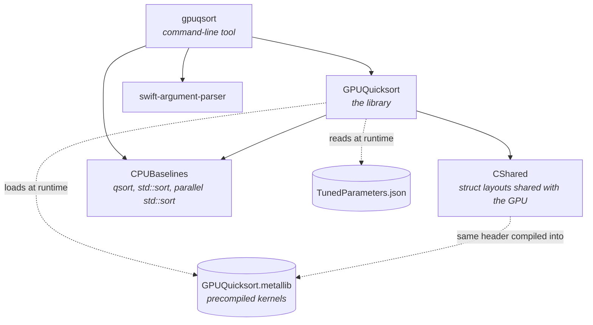
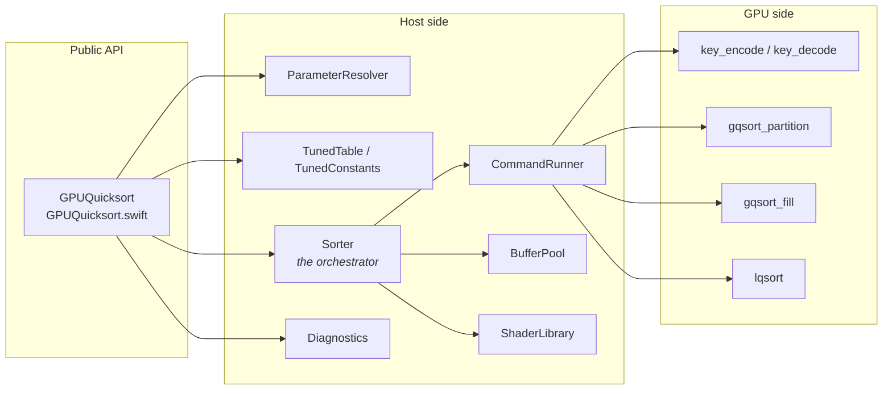
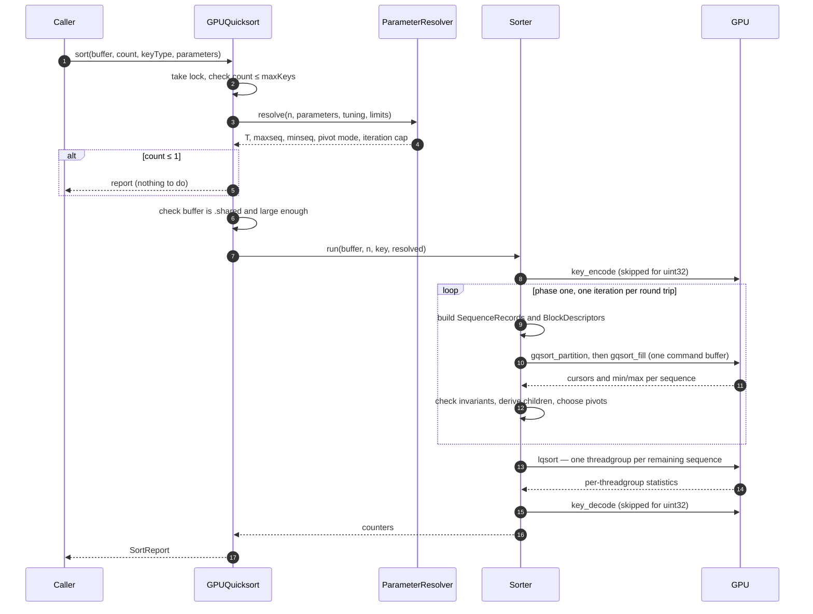
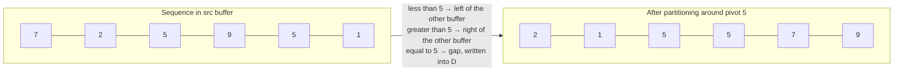
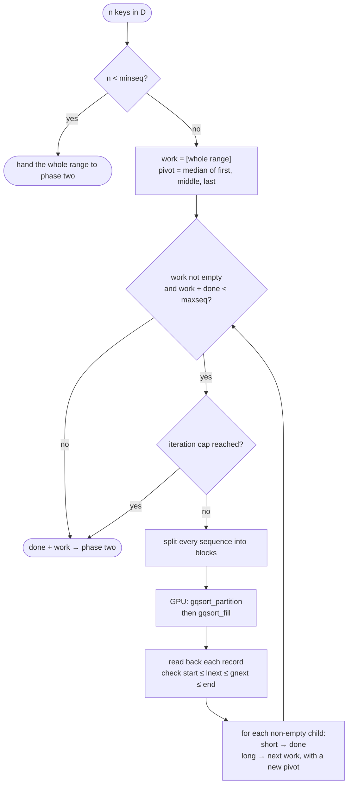
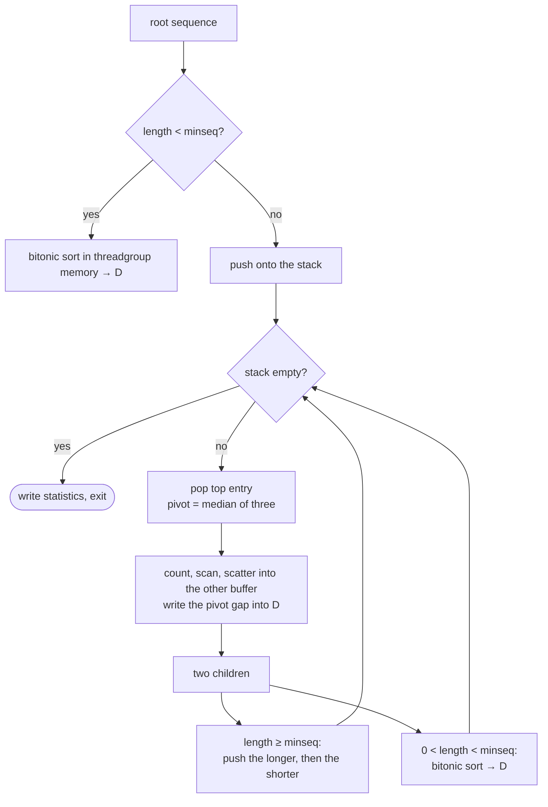
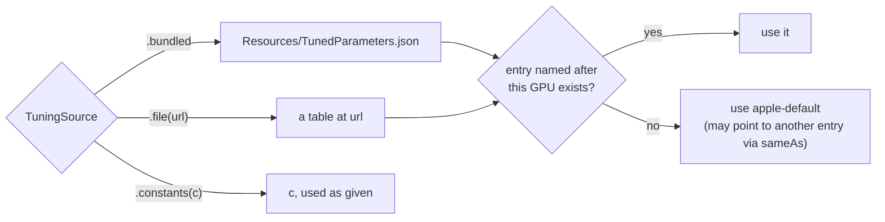

# GPU-Quicksort on Metal — Architecture

This document explains how the code in `Sources/` is put together: what each part does, how a
sort moves through the system, and why the pieces are shaped the way they are. It is written for
someone who wants to read or change the code and has not seen it before.

For the exact rules the code must follow, see [`SPEC.md`](../SPEC.md). Spec identifiers such as
`R-08` or `K-06` appear throughout the source comments; this document mentions them only where
they help you find your way.

---

## 1. The idea in one paragraph

Quicksort picks a *pivot*, moves smaller keys to the left and larger keys to the right, and then
sorts the two sides separately. On a GPU, thousands of threads have to share that work. The
algorithm by Cederman and Tsigas (2009), which this package implements, does it in two phases:

- **Phase one** — while there are only a few large sequences, *many threadgroups cooperate on each
  sequence*. They split it into blocks, partition the blocks in parallel, and use atomic counters
  to agree on where each block's output goes.
- **Phase two** — once there are enough sequences to keep the GPU busy, *each threadgroup takes
  one sequence and sorts it to completion on its own*, using fast on-chip memory and an explicit
  stack instead of recursion.

The host (Swift, on the CPU) drives phase one one iteration at a time and then launches phase two
in a single dispatch.

---

## 2. The package at a glance

The Swift package has five targets. The dependency arrows point from a target to what it uses.



| Target | Language | Role |
| --- | --- | --- |
| `GPUQuicksort` | Swift + Metal | The library: public API, host orchestration, kernels, tuning. |
| `gpuqsort` | Swift | The CLI: `info`, `gen`, `sort`, `verify`, `bench`, `tune`. |
| `CShared` | C header | One definition of every struct the CPU and GPU both read. |
| `CPUBaselines` | C / C++17 | CPU sorts used as benchmark baselines. |
| `GPUQuicksortTests` | Swift | Tests (in `Tests/`, not covered here). |

**The kernels are never compiled at runtime.** `scripts/build-metallib.sh` compiles
`Sources/GPUQuicksort/Metal/GPUQuicksort.metal` ahead of time into two libraries in
`Resources/`: a release one and a `-testhooks` variant for debug builds. A SHA-256 stamp of the
library is shipped alongside it and reported with every sort, so a benchmark result can always be
traced to the exact kernels that produced it.

---

## 3. The main components



| Component | File | Responsibility |
| --- | --- | --- |
| `GPUQuicksort` | `GPUQuicksort.swift` | Public entry point. Validates input, holds a lock so one instance runs one sort at a time, builds the `SortReport`. |
| `ParameterResolver` | `ParameterResolver.swift` | Turns optional user parameters into concrete ones, using `optp` for defaults and checking device limits. |
| `TunedTable` | `TunedParameters.swift` | Loads and validates the per-device tuning table; finds the entry for this GPU. |
| `Sorter` | `Sorter.swift` | Runs the whole sort: encode, phase one, phase two, decode. |
| `CommandRunner` | `CommandRunner.swift` | Creates a command buffer, commits it, waits, adds up GPU time, turns GPU failures into errors. |
| `BufferPool` | `BufferPool.swift` | Allocates the auxiliary buffer (cached between sorts) and the bookkeeping buffers. |
| `ShaderLibrary` | `ShaderLibrary.swift` | Loads the precompiled `.metallib` and builds the compute pipelines. |
| `KeyCodec` | `KeyCodec.swift` | CPU version of the key encoding (the GPU has its own copy). |
| `Diagnostics` | `Diagnostics.swift` | Sends one-line progress messages to `os.Logger` and to an optional callback. |
| `Distributions` | `Distributions.swift` | MT19937 random generator and the seven test-input distributions. |
| `CPUReference` | `CPUReference.swift` | The correctness oracle and the CPU benchmark baselines. |
| Kernels | `Metal/GPUQuicksort.metal` | Everything that runs on the GPU. |
| Shared layouts | `CShared/include/SharedTypes.h` | The structs passed between CPU and GPU. |

---

## 4. The life of one sort

Here is what happens when you call `sort(buffer, count:, keyType:)`:



Everything the caller sees happens **synchronously** — `sort` returns only after the GPU has
finished. Every input check runs *before* the buffer is touched, so a rejected call leaves the
caller's data exactly as it was.

The array convenience method `sort(_ keys: inout [K])` copies the keys into a shared staging
buffer, calls the method above, and copies them back.

---

## 5. Key ideas

### 5.1 Sorting everything as unsigned integers

The kernels only know how to compare `uint` values. Signed integers and floats are first mapped to
unsigned *codes* whose order matches the order of the original values, and mapped back at the end.
For a 32-bit pattern $b$:

$$
\text{encode}_{\text{int32}}(b) = b \oplus \texttt{0x80000000}
\qquad
\text{encode}_{\text{float32}}(b) =
\begin{cases}
\lnot b & \text{if the sign bit of } b \text{ is set} \\
b \oplus \texttt{0x80000000} & \text{otherwise}
\end{cases}
$$

Flipping the sign bit puts negative integers below positive ones. For floats, negative values are
also bit-inverted, because a *larger* magnitude negative float must sort *lower*. `uint32` keys need
no mapping, so the codec pass is skipped for them. The same formulas exist twice — in
`KeyCodec.swift` for the CPU and in the `key_encode`/`key_decode` kernels for the GPU.

### 5.2 Two buffers, taking turns

Partitioning in place would require threads to swap elements with each other, which is slow and
hard to coordinate on a GPU. Instead, the sort uses two buffers of the same size:

- **D** — the caller's buffer, where the sorted result must end up;
- **A** — an auxiliary buffer that `BufferPool` allocates once and reuses.

Each partition step **reads from one buffer and writes to the other**. Every sequence carries a
`src` flag (0 = D, 1 = A) that says where its elements currently are. Keys equal to the pivot are
*not* copied at all: they are already known to be in their final positions, so they are written
straight into **D** as a block of pivot values (the "gap" between the smaller and larger keys).



The two children (`[2, 1]` and `[7, 9]`) now live in the other buffer, and their `src` flag is
flipped. The gap is final.

### 5.3 Counting before writing

Both phases partition a range the same way, in two passes:

1. **Count.** Each thread counts how many of its keys are smaller and larger than the pivot.
2. **Scan.** A parallel prefix sum (a Blelloch scan, `scan2` in the kernel file) turns those counts
   into each thread's starting offset. It scans both counts at once.
3. **Scatter.** Each thread reads its keys again and writes each one to its reserved slot.

Because every thread knows exactly where its output goes, no two threads ever write to the same
place, and no locking is needed within a threadgroup.

---

## 6. Phase one — many threadgroups per sequence

Phase one runs on the host as a loop. Each round is one GPU command buffer.



### 6.1 Splitting into blocks

With $M$ = `maxseq` and $T$ = threads per threadgroup, each iteration picks a block size so that
the total work is spread over about $M$ threadgroups, but no block is smaller than one thread per
key:

$$
\text{blocksize} = \max\!\left(T,\ \left\lceil \frac{\sum_{\text{work}} \text{length}}{M} \right\rceil\right)
$$

Every sequence is cut into blocks of that size (the last one takes the remainder), and each block
becomes one threadgroup, described by a `BlockDescriptor { begin, end, seq }`.

A child sequence is considered "done" — small enough to hand to phase two — when it is shorter than

$$
\text{minlength} = \left\lceil \frac{n}{M} \right\rceil .
$$

### 6.2 How threadgroups share a sequence: `gqsort_partition`

Several threadgroups write into the same sequence's output range, so they need to agree on who
writes where. Each sequence has one `SequenceRecord` with two atomic cursors:

- `lnext` starts at the sequence's `start` and moves **right** as space for small keys is claimed;
- `gnext` starts at the sequence's `end` and moves **left** as space for large keys is claimed.

Each threadgroup counts and scans its block, then **thread 0 makes exactly one atomic operation per
side** to reserve room for the whole threadgroup's output:

```metal
lbeg = atomic_fetch_add_explicit(&r.lnext, sL, memory_order_relaxed);
gbeg = atomic_fetch_sub_explicit(&r.gnext, sG, memory_order_relaxed) - sG;
```

The threads then scatter into their reserved slots in the *other* buffer. The order in which
threadgroups win the atomics is not fixed, so the keys inside each child can land in a different
order from run to run — but each child always ends up holding exactly the right *set* of keys.

When the pivot mode is **min/max average** (the default), each threadgroup also tracks the smallest
and largest key it sent to each side. It reduces them across the SIMD group (`simd_min`/`simd_max`),
then across the threadgroup, and finally records them with one atomic min/max per field. The host
later picks the child's pivot as the midpoint $\text{lo} + \lfloor(\text{hi}-\text{lo})/2\rfloor$,
which avoids overflow. In **median-of-three** mode the host instead reads three keys of the child
and takes their median.

### 6.3 Filling the gap: `gqsort_fill`

Once all partition threadgroups of an iteration have finished, the range $[\text{lnext},
\text{gnext})$ of each sequence is exactly the space left for pivot-equal keys. `gqsort_fill` writes
the pivot there, into **D**. It is a *separate dispatch* in the same serial compute encoder, which
guarantees it starts only after every partition threadgroup has completed — this is what makes the
final cursor values safe to read.

Each block fills an equal share of its sequence's gap. If a sequence has $n_b$ blocks and block
$j$ is the $j$-th of them:

$$
\text{chunk} = \left\lceil \frac{\text{gnext} - \text{lnext}}{n_b} \right\rceil,
\qquad
[\text{lnext} + j\cdot\text{chunk},\ \min(\text{lnext} + (j+1)\cdot\text{chunk},\ \text{gnext}))
$$

### 6.4 Back on the host

After the command buffer completes, `Sorter.phaseOne` reads every record back. If the cursors are
out of order — `start ≤ lnext ≤ gnext ≤ end` fails — the sort stops with
`internalInvariantViolated`. Otherwise each sequence yields up to two children, `[start, lnext)` and
`[gnext, end)`, in the other buffer. Empty children are dropped; short ones go to `done`; long ones
get a pivot and go to the next round's `work`.

The loop stops when there is nothing left to split, when there are enough sequences to fill the
GPU (`work + done ≥ maxseq`), or when it hits the iteration cap (64 by default; the report then sets
`phaseOneCapReached`). Whatever remains in `work` is merged into `done` and passed on.

---

## 7. Phase two — one threadgroup per sequence: `lqsort`

All the sequences from phase one are sorted by **one dispatch** of `lqsort`, with one threadgroup
per sequence. Each threadgroup sorts its sequence to completion without talking to any other.



Three details matter here:

- **An explicit stack, not recursion.** GPU kernels cannot recurse. The pending sequences live on a
  32-entry stack in threadgroup memory.
- **Shorter part first.** The longer child is pushed first, so the shorter one is on top and is
  processed next. This is the classic trick that keeps the stack depth logarithmic. If the stack
  would overflow anyway, the kernel sets an error flag, and the host reports
  `internalInvariantViolated` after the dispatch.
- **Small sequences finish with a bitonic sort.** A sequence shorter than `minseq` is loaded into
  threadgroup memory, padded with `0xFFFFFFFF` up to a power of two, sorted by a bitonic network, and
  written straight to its final place in **D**.

Each threadgroup reports how many partitions and bitonic sorts it did and its maximum stack depth;
these add up to the `phaseTwo*` and `maxStackDepth` fields of the `SortReport`.

---

## 8. Data shared between CPU and GPU

All structs that cross the CPU/GPU boundary are declared once, in `CShared/include/SharedTypes.h`.
The Metal compiler includes it when building the `.metallib`, and Swift imports it through the
`CShared` target. On the GPU the cursor fields are `atomic_uint`; Swift cannot import C atomics, so
on the CPU they are plain `uint32_t` with the same size and offset. A test kernel, `layout_probe`,
reports the sizes and offsets the GPU sees, so the tests can check they match Swift's.

| Struct | Size | One per | Fields |
| --- | --- | --- | --- |
| `SequenceRecord` | 40 B | phase-one sequence | `start`, `end`, atomic `lnext`/`gnext`, `pivot`, `src`, atomic `lmin`/`lmax`/`gmin`/`gmax` |
| `BlockDescriptor` | 16 B | phase-one threadgroup | `begin`, `end`, `seq` (index of its record) |
| `SortSequence` | 16 B | phase-two threadgroup | `begin`, `end`, `src` |
| `SortStats` | 16 B | phase-two threadgroup | `partitions`, `altSorts`, `maxDepth`, `error` |
| `PartitionParams`, `SortParams`, `CodecParams` | 16 B | dispatch | kernel settings |

### Memory budget

Apart from the caller's buffer, a sort of $n$ keys uses:

- the **auxiliary buffer** A: $4n$ bytes (cached and reused across sorts);
- the **bookkeeping buffers**, sized for $M$ = `maxseq`:

$$
\underbrace{40M}_{\text{records}} + \underbrace{16\cdot 2M}_{\text{blocks}} + \underbrace{16\cdot 2M}_{\text{sequences}} + \underbrace{16\cdot 2M}_{\text{statistics}} = 136M \text{ bytes.}
$$

Phase one never needs more than $M$ records or $2M$ blocks per iteration, and never hands more than
$2M$ sequences to phase two, so these buffers are always large enough. (The Lean proof in `proof/`
checks this for all inputs.)

On-chip **threadgroup memory** per threadgroup is bounded by

$$
\text{phase one: } (4T + 16)\cdot 4 \text{ bytes},
\qquad
\text{phase two: } \bigl(\max(2T,\ \text{minseq}) + 3\cdot 32 + 8\bigr)\cdot 4 \text{ bytes},
$$

and `ParameterResolver` only accepts `T` and `minseq` values for which both fit on the device.

---

## 9. Choosing the parameters

Three parameters control performance:

| Parameter | Meaning | Allowed values |
| --- | --- | --- |
| `threadsPerThreadgroup` ($T$) | threads per threadgroup in every kernel | power of two, 32 … 1024, within device limits |
| `maxSequences` ($M$) | when phase one stops splitting | 1 … 65 536 |
| `minSequenceLength` (`minseq`) | below this, use the bitonic sort | power of two, ≥ 64, within threadgroup memory |

Two more are simple switches: `phaseOnePivot` (`.minMaxAverage` by default, or `.medianOfThree`)
and `maxPhaseOneIterations` (64 by default, 1 … 1024).

Any of the first three you leave out is filled in by the paper's formula **`optp`**, which grows
with the number of keys $s$ and is rounded to a power of two:

$$
\text{optp}(s, k, m) = 2^{\left\lfloor \log_2(k\,s + m) + \frac12 \right\rfloor}
$$

A defaulted value is then clamped into its allowed range. **A value you set explicitly is never
clamped** — if it is invalid, the sort throws `invalidParameters` and names the parameter.

The constants $k$ and $m$ for each parameter come from the **tuning table**,
`Resources/TunedParameters.json`:



The table is validated on load: every $k \ge 0$, every $m \ge 1$, and `apple-default` must exist.
`gpuqsort tune` measures a grid of parameter values on the current GPU and fits $k$ and $m$ by least
squares to fill the table in.

---

## 10. Errors, reports and diagnostics

**Errors.** Every failure is one case of `GPUQuicksortError`:

| Group | Cases | CLI exit code |
| --- | --- | --- |
| Bad parameters | `invalidParameters` | 2 |
| Setup | `noMetalDevice`, `unsupportedDevice`, `shaderLibraryMissing`, `shaderLibraryLoadFailed`, `tunedParametersInvalid` | 3 |
| Bad input | `tooManyKeys` | 4 |
| Runtime | `bufferNotShared`, `bufferTooSmall`, `allocationFailed`, `gpuExecutionFailed`, `internalInvariantViolated` | 5 |

`gpuExecutionFailed` is raised by `CommandRunner` when a command buffer completes with an error.
`internalInvariantViolated` is raised when the host reads back something that should be impossible:
out-of-order cursors after phase one, or a stack overflow in phase two.

**Report.** Every successful sort returns a `SortReport` with the resolved parameters, wall and GPU
time, phase-one and phase-two counters, memory used, the library version, the `.metallib` stamp and
the tuning entry in effect.

**Diagnostics.** The library emits one line per phase-one iteration and one summary line per sort,
to `os.Logger` (subsystem `GPUQuicksort`) and to the optional `diagnostics` callback. Key values
never appear in these lines. The CLI's `--verbose` flag prints them to stderr.

---

## 11. The command-line tool

`gpuqsort` is a thin layer over the library, built with swift-argument-parser.

| Command | What it does |
| --- | --- |
| `info` | Prints the device limits, tuning entry, `.metallib` stamp and the parameters chosen for $2^{20}$ and $2^{24}$ keys. |
| `gen` | Writes one of the test distributions as raw little-endian keys. Never touches the GPU. |
| `sort` | Reads a raw key file, sorts it on the GPU, writes the result. |
| `verify` | Sorts generated inputs and compares them bit for bit with the CPU reference. |
| `bench` | Times the GPU sort, and optionally the CPU baselines, and writes CSV or JSON. Every timed run is verified. |
| `tune` | Searches for the best parameters on this GPU, fits `optp`'s constants and can write them to the table. |

`--verbose` and `--table <path>` may appear anywhere on the command line. `bench` and `tune` refuse
to run from a debug build unless given `--allow-debug`, because debug timings are meaningless.

### Test inputs

`Distributions.swift` implements the paper's six input distributions (`uniform`, `sorted`, `zero`,
`bucket`, `gaussian`, `staggered`) plus `fullrange` for tests. They all draw from a 32-bit Mersenne
Twister (MT19937) with a fixed seed, so every run of `gen`, `verify` and `bench` sees exactly the
same keys.

### CPU baselines

`CPUBaselines` provides `qsort`, `std::sort` and parallel `std::sort` through a small C interface.
Together with Swift's `Array.sort()` they are the four CPU baselines `bench --cpu` compares against.
Swift's sort also serves as the correctness oracle for `verify` and the tests.

---

## 12. Test hooks

Debug builds define `GPUQS_TEST_HOOKS`. They then load the `-testhooks` variant of the `.metallib`
and enable extra instrumentation that release builds do not contain:

- counters for how many times each output index is written, and how many atomics are issued;
- observers that see every phase-one iteration and the list handed to phase two;
- ways to inject faults: a failing allocation, a failing command buffer, a corrupted cursor, or a
  smaller phase-two stack.

These let the tests check properties that are otherwise invisible from outside, such as "each key
is written to its final place exactly once", and exercise error paths that are hard to trigger on
real hardware.

---

## 13. Where to start reading

1. `GPUQuicksort.swift` — the public API and the shape of one call.
2. `Sorter.swift` — the whole algorithm from the host's point of view; `phaseOne` is the heart of it.
3. `Metal/GPUQuicksort.metal` — the kernels, in the order `scan2`, `lqsort`, `gqsort_partition`,
   `gqsort_fill`.
4. `ParameterResolver.swift` and `TunedParameters.swift` — how the numbers are chosen.
5. `CShared/include/SharedTypes.h` — the data the two sides exchange.
