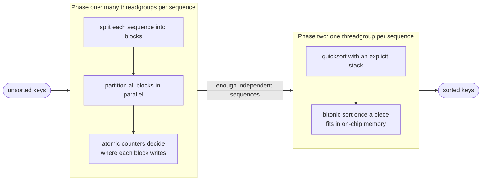
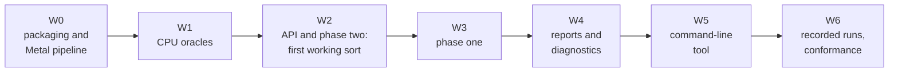
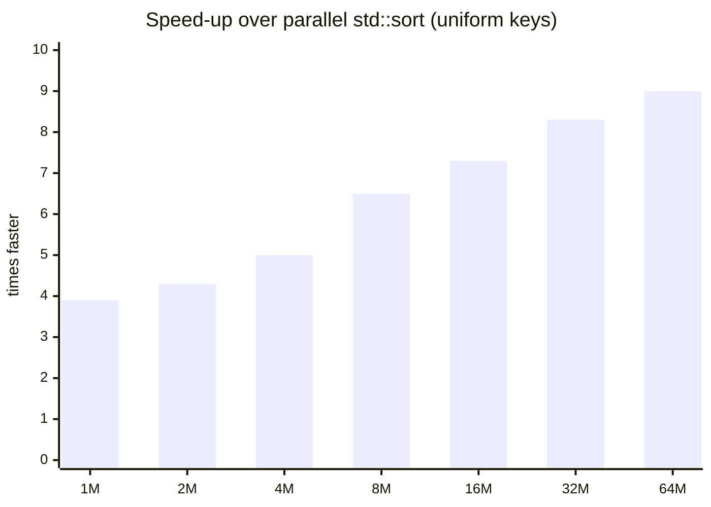
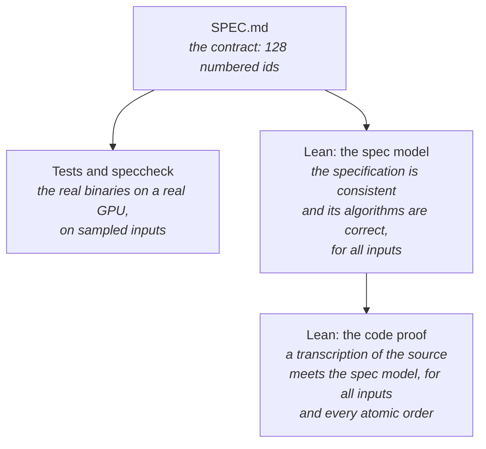

# GPU-Quicksort, Revisited

*Rebuilding a 2009 GPU sorting algorithm for Apple silicon, and proving it correct along the way*

In 2009, Daniel Cederman and Philippas Tsigas published *GPU-Quicksort: A Practical Quicksort
Algorithm for Graphics Processors* (ACM Journal of Experimental Algorithmics,
[doi:10.1145/1498698.1564500](https://doi.org/10.1145/1498698.1564500)). It showed that quicksort,
long thought to be a poor fit for GPUs, could be made fast on the hardware of the time.

This repository takes that paper and carries it to a modern GPU. It does four things:

1. **Specifies** the algorithm precisely, as a written contract with numbered requirements.
2. **Implements** it in Swift and Metal as a library and a command-line tool for Apple silicon.
3. **Measures** it against four CPU sorts, including a parallel C++ sort on all CPU cores.
4. **Proves** it correct in the Lean theorem prover: first the specification, then the code itself.

This article summarizes what was built, how well it works, and how we know it is right. For a tour
of the source code, see [`ARCHITECTURE.md`](ARCHITECTURE.md). The project was built with the
spec-driven method of [speccheck](https://github.com/rioffe/speccheck), which
[Introducing speccheck](https://rioffe.github.io/speccheck/introducing-speccheck.html) explains.

---

## At a glance

| | |
| --- | --- |
| **Speed** | 64 million 32-bit keys in **43 ms**, about **1.55 billion keys per second** (Apple M5 Max) |
| **vs. the CPU** | **9×** faster than parallel `std::sort` on 18 cores; 24× faster than `std::sort`; 145× faster than Swift's `Array.sort()` |
| **Key types** | `UInt32`, `Int32` and `Float` (floats in IEEE 754 total order) |
| **Code** | about 1,700 lines of Swift, Metal, C and C++, plus about 1,300 lines of tests (counted by `cloc`) |
| **Specification** | `SPEC.md`, about 970 lines, with 128 numbered requirements and tests; reviewed in two rounds |
| **Tests** | 56 tests; the `speccheck` conformance checker finds all 128 ids realized and passing |
| **Proofs** | about 6,300 lines of Lean 4 (`cloc`) and over 300 theorems, checked by Lean's kernel |
| **Proven against the code** | 52 of the 88 behavioral requirements; the rest are carried by named tests |

---

## 1. The algorithm in brief

Quicksort picks a *pivot*, puts the smaller keys on one side and the larger keys on the other, and
repeats on each side. The difficulty on a GPU is keeping tens of thousands of threads busy. At the
start there is only one big sequence, but at the end there are thousands of small ones.

GPU-Quicksort solves this with two phases:

- **Phase one** handles the few large sequences at the start. Many threadgroups work on the same
  sequence. Each counts its keys, and **one atomic operation per side per threadgroup** reserves room
  for its output. This is the paper's key idea: synchronization cost is per threadgroup, not per
  key.
- **Phase two** starts once there are enough sequences to fill the GPU. Each threadgroup finishes one
  sequence on its own. It uses fast on-chip memory, and a stack in place of recursion, which GPUs
  lack.

---

## 2. Specification first

Before any code was written, the paper was turned into a specification, `SPEC.md`. It is not a
summary of the paper. It is a contract: every behavior the implementation must have gets a numbered
id, for example:

- `R-09`: one atomic per side per threadgroup;
- `K-08`: the phase-two stack has 32 entries;
- `E-10`: what happens if the stack would overflow.

Each id also names the test that will check it.

The id families cover different kinds of promises:

| Family | Covers | Example |
| --- | --- | --- |
| **R** — requirements | what the algorithm does | the pivot gap is written straight into the output buffer |
| **C** — contracts | exact interfaces and data layouts | `SequenceRecord` is 40 bytes, with these fields |
| **I** — invariants | what must always hold | every index is written with its final value exactly once |
| **K** — constants | pinned numbers and formulas | the default-parameter formula `optp` |
| **E** — edge cases | unusual inputs | an empty array; all-equal keys; too many keys |
| **T** — tests | how each of the above is checked | run `verify` on every distribution and key type |

The specification then went through **two rounds of independent review**. They produced 30 findings
(F-001 to F-030), from blocking gaps (how the tuning table gets bootstrapped on a new GPU) down to
wording. Each was fixed in a new version of the spec. The spec is now at v0.5.

Why spend the effort up front? The spec gives every later step something to be checked against. The
tests cite spec ids, and the conformance checker matches them. The Lean proofs are stated in terms of
the spec. Without a precise spec, "correct" would have no fixed meaning.

---

## 3. Building it

The implementation followed a plan of seven waves. Each wave ended with the code building and its
tests green:

A few engineering choices shaped the result:

- **Two buffers that take turns.** Each partition step reads one buffer and writes the other. This
  avoids in-place swaps, which need fine-grained coordination between threads. Keys equal to the
  pivot are not copied at all: they are already in their final place, so they go straight to the
  output.
- **Sort everything as unsigned integers.** Signed integers and floats are mapped to unsigned codes
  that sort in the same order, and mapped back at the end. The kernels only compare `uint`s. Floats
  come out in IEEE 754 *total order*, with $-0$ before $+0$ and NaNs at the ends.
- **Kernels compiled ahead of time.** The Metal kernels ship precompiled, with a SHA-256 stamp. Every
  sort report and benchmark row records that stamp, so any number can be traced to the exact GPU code
  that produced it.
- **One header for both sides.** The structs the CPU and GPU exchange are declared once, in a C
  header both compilers read. A test kernel reports the layout the GPU actually sees, so a mismatch
  would be caught.
- **Test hooks, debug builds only.** Debug builds contain extra instrumentation: counters that record
  how many times each output index is written, and ways to inject failures. Tests can then check
  properties that are invisible from outside. Release builds carry none of it.
- **Self-tuning.** The paper chooses its three performance parameters with a formula whose constants
  were fitted to its GPU. `gpuqsort tune` refits those constants on the current machine and stores
  them in a table keyed by GPU name.

The result is a Swift package with a library (`GPUQuicksort`) and a command-line tool (`gpuqsort`).
The tool has six commands: `info`, `gen`, `sort`, `verify`, `bench` and `tune`.

---

## 4. How fast is it?

All measurements are from an Apple M5 Max with 18 CPU cores, using release builds. Each value is the
median of five runs, and every result was checked against a CPU reference sort.

### Against the CPU, at 64 million keys

| Input | GPU-Quicksort | parallel `std::sort` | `std::sort` | Swift `Array.sort()` |
| --- | ---: | ---: | ---: | ---: |
| uniform random | **43 ms** | 388 ms | 1,052 ms | 6,255 ms |
| gaussian | **46 ms** | 386 ms | 1,049 ms | 6,244 ms |
| bucket | **45 ms** | 354 ms | 1,082 ms | 4,681 ms |
| staggered | **45 ms** | 222 ms | 1,157 ms | 4,714 ms |
| all equal | **6.8 ms** | 91 ms | 56 ms | 45 ms |
| already sorted | **43 ms** | 109 ms | 44 ms | 45 ms |

The GPU wins on every random distribution from the paper, including `staggered`, which is designed
to produce bad pivots. All-equal input is its best case, at nearly 10 billion keys per second: one
partition pass sends every key into the pivot gap, and the sort is done. The only input where a CPU
keeps up is already-sorted data, which sequential `std::sort` detects and handles in near-linear
time.

### How the advantage grows with size

At small sizes, most of the time is spent on round trips between CPU and GPU: phase one returns to
the host after every iteration. At 1 million keys the GPU is busy only 32% of the time; at 64
million, 90%. So the larger the input, the more the GPU's raw throughput shows.

### A lesson from measurement: choosing the right pivot

The first version used the *median of three* keys as its phase-one pivot, a common textbook choice.
On the `staggered` input at 64 million keys, it needed about **47** phase-one iterations and took
between 367 and 593 ms, varying widely from run to run. The medians split `staggered`'s interleaved
value ranges very unevenly, so some huge sequences reached phase two, where a single threadgroup
must sort each one alone.

The paper's experiments used a different pivot: the **average of the smallest and largest key** in
the sequence. The GPU collects those two values almost for free while partitioning. With that pivot,
`staggered` needs **14** iterations and takes **45 ms**, and every other distribution got faster too,
by 1.08× to 1.57×. The spec was revised (v0.5) to make it the default.

---

## 5. How do we know it is correct?

Sorting bugs on a GPU are hard to catch. A race between threads may appear only on a particular
input, at a particular size, in a particular timing. So this project builds its evidence in layers,
each covering a different gap:

### Layer 1: tests against the spec

There are 56 tests. Each one names the spec ids it checks, and the `speccheck` tool confirms that
every id is realized by a test that passes. Its final verdict: **CONFORMING, 128 of 128 ids**. This
was checked twice, once by exact matching and once with an independent language-model judge.

Tests run the real code on a real GPU. They cover every input distribution, every key type, sizes up
to 64 million, every error path, and the command-line interface. But tests only ever see *some*
inputs.

### Layer 2: proving the specification

[`proof_from_spec/`](../proof_from_spec/README.md) turns the specification itself into
[Lean 4](https://lean-lang.org/), a programming language and theorem prover. There, the spec's
tables become functions and its claims become theorems. Lean's kernel checks every proof mechanically
for **all** inputs, not a sample.

The main results, in plain terms:

- **The two phases together sort.** Phase one partitions the keys, and phase two sorts every
  resulting sequence. Together they write every position exactly once, with its final value. This
  holds for any pivot rule and any parameter values.
- **The parallel partition is correct.** Per-thread counts, a prefix sum, and one atomic per side per
  threadgroup always produce a correct partition. This holds however the keys are divided among
  threads, and in whatever order the atomics happen to run.
- **The phase-two stack cannot overflow.** Processing the shorter part first bounds the stack depth
  for a sequence of length $\ell$:
  $$
  \text{depth} \;\le\; \left\lfloor \log_2 \frac{\ell}{\text{minseq}} \right\rfloor + 1 \;\le\; 25 \;<\; 32 .
  $$
- **The bitonic network sorts** every power-of-two length, using the kernel's own loop structure.
- **The key codes preserve order.** The integer and float mappings are reversible, and comparing
  codes as unsigned numbers gives exactly signed order and IEEE 754 total order.

Modeling the spec also surfaced one new imprecision (F-034): two rows of the spec's lifecycle table
can both apply to the same input, and the spec does not say which one wins.

### Layer 3: proving the code

[`proof/`](../proof/README.md) goes one step further. It **transcribes the Swift and Metal source
into Lean**, line by line, and proves that the transcription refines the spec model. The kernels,
the host loop, the parameter resolver and the key codec are all included.

GPU atomics are the hard part. When many threadgroups race to claim output space, the order in which
their atomic operations take effect differs from run to run. The proof does not assume any
particular order; its theorems hold **for every possible one**.

The headline theorem, `sortRunSpec`, says roughly this. Take any number of keys $n$ with
$2 \le n \le 2^{31}-1$, any valid parameters, and any order of the atomics. Then the host's `run`
finishes without an internal error, and afterwards

$$
D'[i] \;=\; \text{decode}\bigl(\,\text{sort}(\text{encode}(D[0..n)))[i]\,\bigr) \quad \text{for } 0 \le i < n,
\qquad
D'[j] = D[j] \quad \text{for } j \ge n .
$$

In words: the output is the input, sorted in the right order for its key type. Nothing outside the
$n$ keys is touched, and every position is finalized exactly once. Further theorems show that the
bookkeeping buffers are never overrun, and that every step of the algorithm makes progress.

### Being honest about what is proven

A proof is only as good as its assumptions, and the repository states them plainly:

- **Lean proves a transcription of the code, not the files themselves.** Lean cannot read Swift or
  Metal. Each model file opens with a table that maps every source line to its Lean counterpart; that
  mapping is checked by people, not by the machine.
- **The proofs assume the hardware keeps its promises**: that barriers and atomics behave as Metal
  documents them.
- **Some requirements are outside a proof's reach**: timing, memory allocation, driver errors, the
  exact bytes on disk. Of the 88 behavioral ids, 52 are proven against the code, 35 are carried by
  named tests, and 1 is retired. Every id is accounted for in exactly one place.

The layers work together. The proofs cover *all* inputs, but only of a model. The tests cover the
*real* system, but only some inputs. Where a requirement has both halves, both are recorded.

---

## 6. What was found along the way

Each stage of the process caught problems the earlier ones had missed:

| Stage | Found | Example |
| --- | --- | --- |
| Spec review, round 1 | F-001 to F-019 | no way to bootstrap the tuning table on a GPU that has never been tuned |
| Spec review, round 2 | F-020 to F-030 | a benchmark test that ran in a debug build, which the benchmark refuses |
| Implementation and measurement | F-031 to F-033 | small sorts scale worse than predicted, because of CPU–GPU round trips |
| Performance work | the pivot change | median-of-three was 8–13× slower than min/max on `staggered` input |
| Modeling the spec in Lean | F-034 | two lifecycle rules can both apply to the same input |

Two findings remain open. F-031 is the scaling prediction for small sizes. F-032 is that the only way
found to exercise the GPU-failure path is an injected status, because forcing a real GPU error
safely was not possible. Both are recorded, not hidden.

---

## 7. What is next

The performance notes ([`PERFORMANCE.md`](../PERFORMANCE.md)) list concrete next steps. Each would
start as a change to the specification:

- **Remove the phase-one round trips** by computing each iteration's next sequences on the GPU. This
  matters most at small sizes, where it could make sorts up to about 3× faster.
- **Close the float gap.** Floats are 6–18% slower than integers. Part of the cost is the extra
  encode and decode passes; part is that the min/max pivot averages *codes* rather than *values*,
  which splits floats unevenly. Averaging in value space and folding the conversion into the sort
  would fix both.
- **Detect already-sorted input** with one cheap pass, closing the last case where the CPU keeps up.
- **Support 64-bit indices** for sorts beyond about 2.1 billion keys.

---

## 8. Where to look

| To learn about | Read |
| --- | --- |
| Using the library or the command-line tool | [`README.md`](../README.md) |
| How the code is organized | [`docs/ARCHITECTURE.md`](ARCHITECTURE.md) |
| The spec-driven method and its tools | [speccheck](https://github.com/rioffe/speccheck) |
| Why speccheck exists and how it works | [Introducing speccheck](https://rioffe.github.io/speccheck/introducing-speccheck.html) |
| The exact contract | [`SPEC.md`](../SPEC.md) |
| Performance numbers and method | [`PERFORMANCE.md`](../PERFORMANCE.md) |
| Conformance evidence and recorded runs | [`SPEC_BUILD_REPORT.md`](../SPEC_BUILD_REPORT.md) |
| The Lean model of the spec | [`proof_from_spec/README.md`](../proof_from_spec/README.md) |
| The Lean proof of the code | [`proof/README.md`](../proof/README.md) |
| The findings from modeling | [`docs/reviews/SPEC_MODEL_FINDINGS.md`](reviews/SPEC_MODEL_FINDINGS.md) |

The project was built with [speccheck](https://github.com/rioffe/speccheck)'s spec-driven method. In
order, it wrote the spec, reviewed it, planned the build, built the code against the spec, modeled
the spec in Lean, and proved the code against that model. Each step left a checked record in the
repository.
